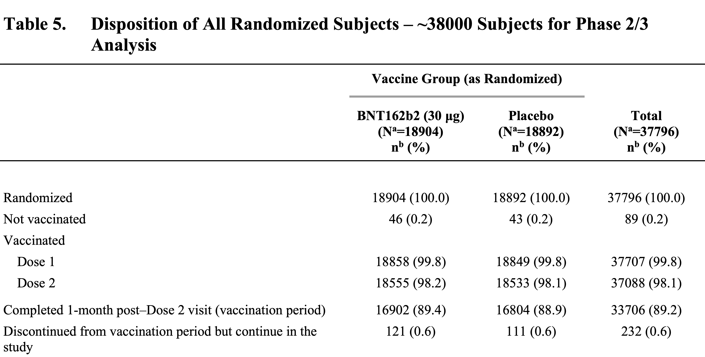
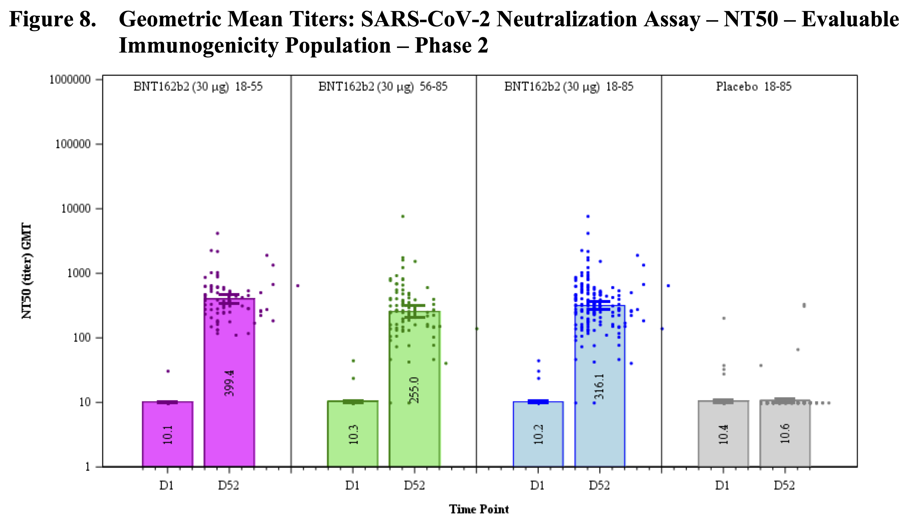

```{r xaringan-themer, include=FALSE, warning=FALSE}
library(seminr)
source(here::here("slides", "style.R"))
```

```{r setup, include=FALSE}
library(tidyverse)
library(datasets)
library(kableExtra)
library(purrr)
library(scales)
library(likert)
library(jmv)
library(DiagrammeR)
library(dataforsocialscience)
library(DiagrammeRsvg)
```


# Wiederholung

<!---->


Uns interessiert eigentlich die Wirkung zwischen den "latenten" Variablen.

---

# Nachteile
## Viele Schritte um zum Ergebnis zu kommen.
1. Faktorenanalysen
2. Reliabilitätsanalysen
3. Hypothesentests

## Keine Kausalbeziehungen 
Erkenntnisse sind immer Assoziationen und keine kausalen Beziehungen!

## Keine Mediationsanalyse
Im schrittweisen Erklären der einzelnen Modellteile gehen Informationen verloren.

---

# Assoziation und Kausalität
Jede Regression lässt sich auch "rückwärts" rechnen.

.tiny[
```{r}
jmv::linReg(robo_care, dep = cse, cov = age, blocks = c("age"))
```
]


---

# Assoziation und Kausalität
Jede Regression lässt sich auch "rückwärts" rechnen.

.tiny[
```{r}
jmv::linReg(robo_care, dep = age, cov = cse, blocks = c("cse"))
```
]

---
# Umkehrbarkeit von lineare Gleichungen

## Y als abhängige Variable
$$ y = b\times x + c$$
--

## X als abhängige Variable
$$ x = \frac{y - c}{b} $$

---
# Kausale Modelle?

Kann ich ein Modell formulieren, in dem eine Änderung der unabhängigen Variablen eine Änderung der abhängigen Variable "verursacht" aber nicht umgekehrt?

```{r test, echo=FALSE, dev = "svg", results='asis', out.height=300}
options(htmltools.preserve.raw = FALSE)
grViz("
       digraph g {
       graph[
        rankdir=LR;
       ]
       node 
       [
       shape = ellipse
       ]
       
       edge [
       color = 'black'
       ]
       CSE -> Age
       edge [
       color = 'red'
       ]
       Age -> CSE 

       }
       ")
```

--

## Mathematik kennt keine "Richtung"
Innerhalb der Statistik/Mathematik gibt es keinen "do"-Operator.

---
# Randomized Controlled Trial

Goldstandard der kausalen Statistik

## Doppelblind Gruppierung
 - Es werden zwei Gruppen gebildet: **Test**gruppe und **Kontroll**gruppe
 - Gruppenzuweisung erfolgt zufällig und doppelblind 

## Testdurchführung

 - Testgruppe bekommt die Veränderung
 - Kontrollgruppe bekommt die Veränderung nicht

## Auswertung
 - Veränderungen, die nur in der Testgruppe stattfinden, sollten auf die Veränderung zurückzuführen sein.

---
# Beispiel
Pfizer/BioNTech Impfstoff ([Link](https://www.fda.gov/media/144246/download) zur Originalstudie)


---
# Beispiel
Pfizer/BioNTech Impfstoff ([Link](https://www.fda.gov/media/144246/download) zur Originalstudie)




---

# Strukturgleichungsmodelle

## Observational Study
Häufig können Veränderungen nur beobachtet und nicht verursacht werden.

Was tun?

## Voraussetzungen für kausale Erkenntnis in Beobachtungsstudien

1. Gute theoretische Herleitung der Modellannahmen
2. Entwurf eines Modells, dass andere Interpretationen verhindert.

Verschiedene Ansätze:
- Kausale Modelle, Directed Acyclic Graphs (DAGs), Do-Operator

Für uns relevant:
## Strukturgleichungsmodelle

---
# Structural Equation Modelling (SEM)

Zwei unterschiedliche Verfahren:
1. Kovarianzbasierte Modelle (CB-SEM)
2. Varianzbasierte Modelle (VB-SEM)

Beide Modellarten sind graphische Modelle!

--

## Gemeinsamkeiten
1. Latente Variablen werden als Ellipsen dargestellt
2. Manifeste Variablen werden als Rechtecke dargestellt
3. Kausale Beziehungen werden als Pfeile dargestellt

---
#Graphische Modelle


```{r echo=FALSE, out.height="300px"}
grViz('
      digraph g{
      graph
      [rankdir=LR
      fontname="helvetica"
      ]
      
      node [
      fontname = helvetica
      shape = box
      ]
      kut1;kut2;kut3;
      robo_face;
      robo_wash
      
      node [
      fontname = helvetica
      shape = ellipse
      ]
      KUT
      Akzeptanz
      
      kut1 -> KUT;
      kut2 -> KUT;
      kut3 -> KUT
      
      KUT -> Akzeptanz
      
      Akzeptanz -> robo_face 
      Akzeptanz -> robo_wash
      }
      ')
```

Manifest Variablen vs. Latente Variablen
- Exogene Variablen: Werden nur durch Manifestvariablen bestimmt
- Endogene Variablen

SEM prüft alle Pfade in einem mathematischen Modell
- Dabei werden "Werte" für latente Variablen ermittelt
---
# Mobi Dataset

Daten einer Mobiltelefon Nutzerbefragung (n=250).
1. Expectation - Erwartungen gegenüber dem Anbieter
2. Satisfaction - Zufriedenheit mit dem Anbieter
3. Loyalty - Loyalität zum Anbieter
4. Complaints - Beschwerden beim Anbieter
5. etc.
--

## SEM Modelle auf Mobi Daten
Vorgehensweise
1. Hypothese ist eine Modellkombination aus
  1. **Messmodell**: Welche Manifestvariablen messen welche latenten Variablen
  2. **Strukturmodell**:  Welche Beziehungen bestehen zwischen latenten Variablen
3. Es werden immer alle Pfade gleichzeitig "geschätzt".

---
# Beispiel-Modell
## Strukturmodel
```{r echo = FALSE, out.height="200px"}
library(seminr)
measurements <- constructs(
  reflective("Expectation", multi_items("CUEX", 1:3)),
  reflective("Satisfaction", multi_items("CUSA", 1:3)),
  reflective("Loyalty",     multi_items("CUSL", 1:3)),
  composite("Complaints",  single_item("CUSCO"))
)
structure <- relationships(
  paths(from = "Expectation", to = "Satisfaction"),
  paths(from = c("Satisfaction", "Expectation"), to = "Loyalty"),
  paths(from = "Satisfaction", to = c("Complaints"))
)

#my_model <- estimate_pls(data = mobi, measurements, structure)

plot(structure)
```


Pfade sind dabei immer (multiple) lineare Regressionen.

z.B. $Loyalty = b_{sl} \times Satisfaction + b_{el} \times Expectation + c + \epsilon$

--

Was nicht offensichtlich ist:
$Loyalty = b_{sl} \times Sat. + b_{el} \times Exp. + b_{cl} \times Complaints + c + \epsilon$
und 

$b_{cl}$, soll so nah an Null wie möglich sein.

---
# Beispiel-Modell
##  Messmodell
```{r echo = FALSE, out.height ="400px"}
plot(measurements)
```

3 Typen von Messungen

---
# Beispiel-Modell
.tiny[
```{r, out.height="300px"}
measurements <- constructs(
  composite("Complaints",  single_item("CUSCO"), mode_A),      # correlation
  composite("Loyalty",     multi_items("CUSL", 1:3), mode_B),  # regression
  reflective("Expectation", multi_items("CUEX", 1:2))          # latent factor
)
plot(measurements)
```
]

---
# Model berechnen
## Varianz-basiertes Modell mit PLS-Schätzung (partial least squares)

```{r}
library(seminr)
measurements <- constructs(
  composite("Expectation",   multi_items("CUEX", 1:3)),
  reflective("Satisfaction", multi_items("CUSA", 1:3)),
  reflective("Loyalty",      multi_items("CUSL", 1:3)),
  composite("Complaints",    single_item("CUSCO"))
)
structure <- relationships(
  paths(from = "Expectation", to = "Satisfaction"),
  paths(from = c("Satisfaction", "Expectation"), to = "Loyalty"),
  paths(from = "Satisfaction", to = c("Complaints"))
)

model <- estimate_pls(mobi, measurements, structure)
```

---
# Model analysieren

## Messmodellgüte prüfen

```{r}
summary(model)
```


---
# Model plotten

```{r}
plot(model)
```


---
# Model optimieren
## Manifest Variablen entfernen
```{r}
library(seminr)
measurements <- constructs(
  composite("Expectation", multi_items("CUEX", 1:2)),
  reflective("Satisfaction", multi_items("CUSA", 1:3)),
  reflective("Loyalty",     multi_items("CUSL", c(1,3))),
  composite("Complaints",  single_item("CUSCO"))
)
structure <- relationships(
  paths(from = "Expectation", to = "Satisfaction"),
  paths(from = c("Satisfaction", "Expectation"), to = "Loyalty"),
  paths(from = "Satisfaction", to = c("Complaints"))
)

model <- estimate_pls(mobi, measurements, structure)
```

---
# Model prüfen

```{r}
summary(model)
```

---
# Model Plot
```{r}
plot(model)
```

## Modell ok?

---

# Bootstrapping
## Notwendig für zufallsabhängige Schätzung

```{css, echo = FALSE}
.teeny .remark-code { /*Change made here*/
  font-size: 70% !important;
}
div.tiny { /*Change made here*/
  font-size: 70% !important;
}
```

.tiny[
```{r}
model_bst <- bootstrap_model(model)
smry <- summary(model_bst)
smry$bootstrapped_HTMT
```
]

---
# Diskriminanzvalidität
## Hetero-Trait-Mono-Trait Ratio

Misst wie ähnlich sich Konstrukte sind. Ideal ist HTMT < 1.

--

```{r}
smry$bootstrapped_HTMT
```

---
# Bootstrapped Model Plot

```{r}
plot(model_bst)
```

---
# Was kann schief gehen?

## Messmodell passt nicht?
Egal wie viel man weglässt, immer bleibt etwas unter den Schwellen. KEIN SEM.

## Modell ist unterspezifiziert
Die Anzahl an Daten und Manifestvariablen reichen nicht aus, um das Modell zu schätzen.

SEM benötigt...
- gute Theoriearbeit
- kausale Hypothesen
- relativ große Stichproben 
 
---
# Was gibt es noch?

## Higher Order Constructs
- Konstrukte setzen sich aus Unterkonstrukten zusammen.
  - z.B.: Intelligenz besteht aus kristalliner und fluider Intelligenz
- Beide Unterkonstrukte müssen wieder einzeln gemessen werden.
- Keine Manifestmessung der Oberkonstrukte.


## Interaktionseffekte
- Eine Variable kann den Einfluss einer Variable auf eine andere **moderieren**.
  - z.B. "Die Kontrollüberzeugung im Umgang mit Technik beeinflusst mit steigendem Alter die Akzeptanz mobiler Robotik."
 
```{r echo=FALSE, out.height="200px"}
dot <- 'digraph {
  A [label = "IV: KUT"]
  B [label = "DV: Akzeptanz"]
  C [label = "Moderator: Alter"]
  empty [label = "", shape = point, width = 0, height = 0]

  A -> empty  [arrowhead = none, weight = 1000]
  empty -> B [weight = 1000]
  C -> empty [constraint = FALSE]
  C -> B
}
'
DiagrammeR::grViz(dot)
```
 
---
# CB-SEM vs. VB-SEM

## VB-SEM (PLS-SEM, SmartPLS, PLSc, SEMinR, etc.)
- geeignet für kleinere Strichproben (N=150-250)
- geeignet für Exploration kausaler Modelle

## CB-SEM (AMOS, Lisrel, lavaan, etc.)
- konfirmatorischer Ansatz
- noch größere Stichproben (N>500)
- nur Latent-Faktor Messmodelle
- Zusätzlich Kovarianzen zwischen Items verschiedener Konstrukte erlaubt
  - müssen aber im Modell angegeben werden!

---
# Beispiel mit SEMinR

.tiny[
```{r}
cbs <- estimate_cbsem(mobi, as.reflective(measurements), structure)

summary(cbs)
```
]


---
# Model Plot
```{r}
plot(cbs)
```

---
# Zusammenfassung

## Zwei Arten von Strukturgleichungsmodellen
- Kovarianzbasierte Verfahren
- Varianzbasierte Verfahren

## Notwendige Schritte
1. Konstruktion und Überprüfung des Messmodells
2. Konstruktion und Überprüfung des Strukturmodells
3. Schätzen und Prüfen des Gesamt-Modells
4. Bootstrapping

## Achtung!
- Komplexe Modelle ersetzen nicht gut durchdachte Erhebungs-/Experimentalmethodik
- Epiphänomene können fälschlicherweise kausale Zusammenhänge liefern
  - Theoriearbeit ist umso wichtiger! 
---
class: inverse, center, middle
---
class: inverse, center, middle
## .yellow[ [Zurück zur Übersicht](index.html)]
