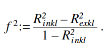

```{r setup, include=FALSE}
options(htmltools.dir.version = FALSE)
```

# Evaluating a model:
- Following, we present how the quality of a structural-equation model should be evaluated.
- There are primary quality or evaluation criteria.
- Further, Systematicall application to PLS path models.

# Overview:

- primary quality or evaluation criteria and their systematic application to PLS-path-models 
- evaluation of reflective specified measurement models: application of relevant evaluation criteria and their appropriate evaluation 


---

# Evaluation - in general:
- In the evaluation of PLS pathway models: Starting point: R2 from the regressions of the individual endogenous latent variables of the structural model.
- interpret as in ordinary regressions
- Path values: can also be considered as coefficients of an ordinary (multiple) regression

- R2 change analysis > whether an independent latent variable exerts a substantial influence on a dependent variable
- Effect size f2: calculated from different R2 when the independent latent variable in question is included in the dependent latent variable (R2 incl) or not (R2 excl): 
 

Values for f 2 of more than 0.02 / 0.15 / 0.35: independent latent variable has small /medium / large influence on dependent latent variable 


(Henseler, J. (2005). Einführung in die PLS-Pfadmodellierung. Wirtschaftswissenschaftliches Studium, 34(2), 70-75.)
---

# Evaluation - Validation:
- Validation of determined estimated values: resampling techniques
-- allow evaluation of stability of determined model parameters
- From the raw data matrix: n times a number k of observations (with or without regression) are drawn from the raw data matrix. transformed to a modified raw data matrix. 

---

# Evaluation of measurement models

- estimation of model > empirical measured variables to assess the relationship between the indicators and constructs (measurement models) and between the different constructs (structural model)

---

