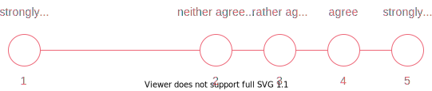

```{r setup, include = FALSE}
library(tidyverse)
library(seminr)
library(knitr)
library(kableExtra)
```
# Data preparation

1. Data requirements
2. Recoding variables 
3. Treating missing values
3. Renaming variables

???
In this video, I will outline the basics of data preparation for SEMinR.
This means making sure that SEMinR is able to correctly interpret your data and estimate a model.
First, I will give an overview of requirements for data to be used in SEMinR estimations.
Then I will talk in detail about why and how you should recode and rename variables and treat missing data. 

---

# Data preparation steps

Basic steps:
* Recoding variables
* Treating missing data
* Renaming variables

Advanced steps:
* Examining data distribution
* Removing low quality responses
* Treating outliers

???
Before you can start with model estimation, you have to prepare your data.
As you can see, there are lots of things you can do with your data before writing even one line of SEMinR code.
If you have done statistical analyses before, you will likely be familiar with many of these steps.

In this video, I will focus on basic data preparation.
This means making sure your data can be used by the algorithm to estimate a model.
For the more advanced steps, we will upload separate videos.
In this video, I will demonstrate how to do each step using R.
Of course, if you are used to do data preparation in another software like SPSS, you are free to keep doing it your way.

---

# Example data

```{r, echo = FALSE, include = TRUE}
dfgoal <- mobi[1:6,1:5]
df <- dfgoal <- mobi[1:6,1:5] %>%
  rename_with(~ c(
    "Quality Expectation",
    "Expectation Products",
    "Problem Expectation",
    "Satisfaction Overall",
    "Expectation Fulfillment"
    ))
df[c(1,4,6),5] <- NA
df[,2] <- df[,2] %>%
  recode(
  `7` = "rather agree",
  `9` = "agree",
  `10` = "strongly agree"
)
df[,3] <- df[,3] %>%
  recode(
    `5` = 6,
    `6` = 5,
    `7` = 4,
    `9` = 2,
    `10` = 1
  )
df %>%
  knitr::kable(format = 'html')
```


???
Let's assume we start out with a bunch of data collected in a survey.
Here, we have a small slice of such a data set.
Specifically, this is a modified portion the mobi data set which is also included in the SEMinR package.
The mobi data set contains data on how satisfied customers are with their mobile phone provider.
Our example data set contains
* 5 variables and
* 6 observations.
The variables are the columns of this table.
Each variable represents a survey question.
The column contains all the answers we have collected to the question.
The observations are the rows of this table.
An observation is the set of all answers a single respondent has given to our survey.
So, what should we do with this data?

---

# Recoding variables: Numerical

```{r, echo = FALSE, include = TRUE}
df %>%
  knitr::kable(format = 'html') %>%
  column_spec(2,
              background = "#FFAABB")
```


???
Needless to say, SEMinR only handles numerical data.
So we need to recode the highlighted variable.
But I want to take this opportunity to quickly touch on the way data for a structural equation model should be measured.

---

# Recoding variables: Data type

Data should be
* numerical

But also...

--

... approximately equidistant


???
So, as I said, the data should be numerical so the SEMinR algorithm can do calculations with it.
But when it does those calculations, there is another implicit assumption about your data.
This assumption is that the distance between the numerical values is equidistant, e.g., that the distance between 1 and 2 and between 2 and 3 is roughly the same, like in this example. 
(Next Slide part)
Or to say it differently,  the algorithm handles your data as if it was interval scaled.
Now, for many reasons it can be argued that it is impossible to collect interval scaled psychological data.
Still, when you collect your data using measures like Likert scales or percentages of agreement, you should try and ensure that the scale is, let's say, as equidistant as possible.

---

# Recoding variables: Data type

Data should be
* numerical

But also...

... approximately equidistant (i.e., not scaled like this)




???
So avoid to create a scale similar to this.
From this, it also follows that categorical data, e.g. gender or profession, cannot be used in PLS-SEM constructs.
If you want to test the influence of such data, you have to do something similar to a ANOVA or a t-test:
Estimate a separate SEM for each group and then compare them in a multigroup analysis.

---

# Recoding variables: Data type

Data should be
* numerical
* ordinal scaled
* and the scale should be approximately equidistant

???
So, to summarize:
Your data needs to be numerical, ordinal scaled and as close to equidistant as possible.

---

# Recoding variables: Data type

```{r, echo = FALSE, include = TRUE}
df %>%
  knitr::kable(format = 'html') %>%
  column_spec(2,
              background = "#FFAABB")
```

???
Now, let's take a quick look on what we need to do to our example data if we want to recode it in R.
Of course, there are many ways to do this.

---

# Recoding variables: Data type

```{r echo=TRUE}
df[,2] <- df[,2] %>%
  recode(
  "rather agree" = 7,
  "agree" = 9,
  "strongly agree" = 10  
  )
```

???
One relatively quick way is the recode function from the dplyr package.
We choose the second column and tell R which answer option should be replaced by which number.
If you have a full data set, you have to assign numbers for each possible answer option.

---

# Recoding variables: Data type

```{r, echo = FALSE, include = TRUE}
df %>%
  knitr::kable(format = 'html') %>%
  column_spec(2,
              background = "#99DDFF")
```

???
Much better.

---

# Recoding variables: Direction

```{r, echo = FALSE, include = TRUE}
df %>%
  knitr::kable(format = 'html') %>%
  column_spec(3,
              background = "#FFAABB")
```

???
Let's take a look at the next highlighted variable.
This variable is reverse coded.
That means that it has a different direction than its related variables.
Let me illustrate this.

---

# Recoding variables: Direction

```{r, echo = FALSE, include = TRUE}
df %>%
  knitr::kable(format = 'html') %>%
  column_spec(3,
              background = "#FFAABB") %>%
  column_spec(1:2,
              background ="#99DDFF") %>%
  add_header_above(
    c(
      "Expectation" = 3,
      "Satisfaction" = 2
    ),
    background = c("#99DDFF"," ")  
  )
```

???
In our example data, the first three variables are supposed to measure facets of the same underlying concept.
Specifically, they are supposed to measure the expectation a customer has of their mobile phone provider.
The first variable in our data set refers to overall quality expectations, and the second variable to expectations about products and services.
The third variable, which is highlighted here, refers to the expectation how often problems would occur.
So where high values for the first two variables correspond with high expectations, a high value for the third variable corresponds with low expectations.
Often, you can recode your question in advance using the survey software.
But if you haven't, here is how you could do it in R. 

---

# Recoding variables: Direction

```{r echo = TRUE}
df[,3] <- df[,3] %>%
  recode(
    `1` = 10,
    `2` = 9,
    `3` = 8,
    `4` = 7,
    `5` = 6,
    `6` = 5,
    `7` = 4,
    `8` = 3,
    `9` = 2,
    `10` = 1
  )
```

???
We simply use the recode function again, only with numbers instead of strings.

---

# Recoding variables: Direction

```{r, echo = FALSE, include = TRUE}
df %>%
  knitr::kable(format = 'html') %>%
  column_spec(1:3,
              background ="#99DDFF") %>%
  add_header_above(
    c(
      "Expectation" = 3,
      "Satisfaction" = 2
    ),
    background = c("#99DDFF", "")  
  )
```

???
Now, all variables are coded in the same direction.

---

# Treating missing values

```{r, echo = FALSE, include = TRUE}
df %>%
  knitr::kable(format = 'html') %>%
  column_spec(5,
              background = "#FFAABB") %>%
  add_header_above(
    c(
      "Expectation" = 3,
      "Satisfaction" = 2
    ),
    background = c("","#99DDFF")
  )
```

???
Let's take a look at the last variable in our data set.
There are three values missing.
The SEMinR algorithm cannot work with missing data.
This means if you use a variable in the SEM where there is a value missing, SEMinR will not use the observation that includes this missing value at all.

---

# Treating missing values

```{r, echo = FALSE, include = TRUE}
df %>%
  knitr::kable(format = 'html') %>%
    column_spec(4,
              background = "#99DDFF") %>%
  column_spec(5,
              background = "#FFAABB") %>%
  add_header_above(
    c(
      "Expectation" = 3,
      "Satisfaction" = 2
    ),
    background = c("","#99DDFF")
  )
```

???
In our example, the last two variables measure facets of satisfaction.
As explained, if you use both variables in your SEM without doing anything about your missing variables...


---

# Treating missing values

```{r, echo = FALSE, include = TRUE}
df %>%
  knitr::kable(format = 'html') %>%
  add_header_above(
    c(
      "Expectation" = 3,
      "Satisfaction" = 2
    )
  ) %>%
  row_spec(c(2:3,5), background = "#99DDFF")
```

???
... only the highlighted observations, or rows, will be used to estimate the SEM.
In our case, that means we are using only half our sample, even though the observations contain values for all other variables!
If multiple variables are missing values for different observations, the sample size for your SEM might suddenly be much smaller than expected.
Therefore, you should carefully consider what to do with missing data.

---

# Treating missing values

* Impute missing data
* Remove variables containing missing data

--

```{r echo = TRUE}
df <- df[,-5]
```

???
If a variable is missing only a small amount of data, you might impute data.
This means that you replace the missing values with substitute data.
For example, you might replace them with the mean value of the variable.
While this is unlikely to skew the results of your model, it might also make it more unlikely you find significant relationships.
So another option is to simply not use the variable containing missing data in your SEM.
Especially when there is a lot of data missing, this should be the method of choice.
In their 2017 primer on structural equation modeling, Hair et al. name 15 % as the threshold for missing data over which a variable should be removed.
Of course, when you are working with a real data set, you will have to weigh the benefits of each option when deciding how to handle missing data.
(new slide part)
Fortunately, for our example, the decision is easy.
Half the data for theh variable is missing, so let's get rid of it.

---

# Renaming variables

```{r echo = FALSE, include = TRUE}
df %>%
  knitr::kable(format = 'html') %>%
  add_header_above(c("Expectation" = 3,
                     "Satisfaction" = 1))
```


???
The last point I want to talk about in this video is renaming the variables.
As you can see, the variables in my data set have very descriptive names.
This is useful when I want to see at a glance what exactly each variable refers to.
But if you want to use your data in SEMinR, it makes sense to rename them.
---

# Renaming variables

.pull-left[
Long variable names...
```{r echo=FALSE, out.width='90%'}
specify_model(
  measurement_model = constructs(
    reflective(
      construct_name = "Expectation",
      item_names = c(
        "Quality Expectation",
        "Expectation Products",
        "Problem Expectation"
      )
    ),
    reflective(
      construct_name = "Satisfaction",
      item_names = c("Satisfaction Overall")
    )
  ),
  structural_model = relationships(paths(from = "Expectation",
                                         to = "Satisfaction"))
) %>%
  plot()
```
]

--

.pull-right[
... vs. abbreviated names
```{r echo=FALSE, out.width='90%'}
specify_model(
  measurement_model = constructs(
    reflective(
      construct_name = "Expectation",
      item_names = multi_items("CUEX", 1:3)
    ),
    reflective(construct_name = "Satisfaction",
               item_names = "CUSA1")
  ),
  structural_model = relationships(paths(from = "Expectation",
                                         to = "Satisfaction"))
) %>%
  plot()
```
]


???
Let's take a look at this example path model using our data set.
You can imagine this gets crowded pretty quickly.
(next slide part) 
Especially as most models you build will likely contain many more variables.
But the main reason is  that it makes model specification much easier.

---

# Renaming variables

Long variable names...
```{r echo=TRUE}
measurement_model <- constructs(
  reflective(
    construct_name = "Expectation",
    item_names = c(
      "Quality Expectation",
      "Expectation Products",
      "Problem Expectation"
    )
  ),
  reflective(
    construct_name = "Satisfaction",
    item_names = c("Expectation Fulfillment")
  )
)
```


???
This is what the SEMinR code would look like for the example.
For an in depth description of how to specify the measurement model in SEMinR, please refer to our measurement model video.

---

# Renaming variables

... vs. abbreviated names
```{r echo=TRUE}
measurement_model <- constructs(
  reflective(
    construct_name = "Expectation",
    item_names = multi_items("CUEX", 1:3)
  ),
  reflective(construct_name = "Satisfaction",
             item_names = "CUSA1")
)
```


???
But even at a glance it is obvious that you code gets more succinct when you rename your variables.

---

# Renaming variables

... vs. abbreviated names
```{r tidy=FALSE, eval=FALSE}
measurement_model <- constructs(
  reflective(
    construct_name = "Expectation",
    item_names = multi_items("CUEX", 1:3)   #<<
  ),    
  reflective(construct_name = "Satisfaction",
             item_names = "CUSA1")
)
```

???
In SEMinR, you can use the multi_items() function you describe your measurement model.
For this, SEMinR assumes all your variables are named after the pattern prefix-number.
In our example, we have three variables describing Expectation.
Therefore, we could rename all variables associated with Expectation to CUEX and number them from 1 to 3.
Similarly, all variables associated with Satisfaction could be renamed to CUSA - although in our example, there is only one variable left.
For a small model like this, this might seem tedious.
But real-life models will not only likely contain more variables, but you will almost always have to modify and re-specify them.
In the long run, having renamed the variables will save you a lot of time.

---

# Renaming variables

Rename variables associated with the same construct with the same prefix, e.g. for *CUSA* for *Customer Satisfaction*

```{r}
df <- df %>%
  rename("CUSA1" = "Satisfaction Overall")
```

--
```{r}
df <- df %>%
  rename_with(~ paste0("CUEX",
                       1:3),
              .cols = c(1:3))
```

???
So how would you do it in R?
Again, there is a lot of ways, but one way is using the rename function.
Let's start with the last variable, the one with Satisfaction.
And what if we want to rename multiple variables at once?
(next slide part)
That's easy, too.
We can use rename_with and paste0 to rename them all at once.

---

# Summary

```{r, echo = FALSE}
df %>%
  knitr::kable(format = 'html')
```


* Data is numerical and unidirectional
* There are no missing values
* Variables are named for use in SEMinR 

???
And that's it, you're done with basic data preparation.
To summarize, you should take care that you data is coded correctly, that you have taken care of missing values and that you have renamed your variables so you can easily use them in your SEMinR code.


---

# Sources for this video

Hair, J. F., Hult, G. T. M., Ringle, C. M., & Sarstedt, M. (2017). A primer on partial least squares structural equation modeling (PLS-SEM) (Second edition). Sage.
