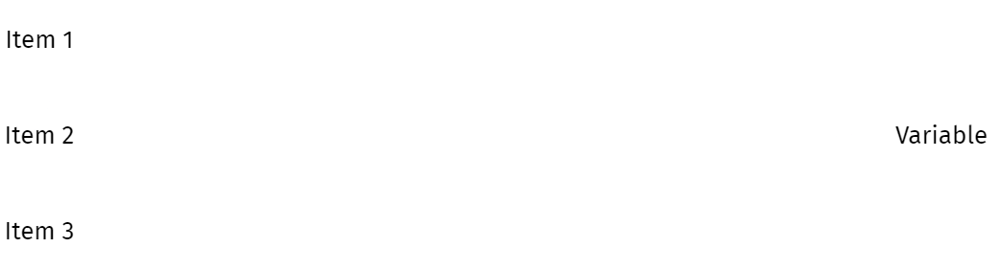

```{r setup, include = FALSE}
library(tidyverse)
library(seminr)
library(jmv)
library(dataforsocialscience)
```

# Welcome

- Structural equation modeling using **SEMinR**

???
Hello and welcome to our online course on structural equation modeling in SEM-in-R.
In this course, I will take you through the principles and practice of structural equation modeling using the SEM-in-R package for R.
--

- Basic course: 7 videos

???
The basic section of this course is structured into seven videos.
They reflect the sequence of steps you will take when designing a structural equation model of your own.
If you are still curious after that, you are welcome to proceed to the advanced section.
There, I will go into more detail on some of the issues touched upon in the basic section.
I will also describe some more sophisticated modeling technique.
Before starting with the content of this first video in earnest, I need to add one thing:
--

- Focus on **partial least squares** structural equation modeling (PLS-SEM) - as opposed to **covariance-based** structural equation modeling (CB-SEM)
???
In structural modeling, there are two main streams.
Partial least squares equation modeling, which is also known as variance-based structural equation modeling, and covariance-based structural equation modeling.
Although you can both types of modeling in SEMinR, in this series, we will focus on PLS-SEM.
Now that is out of the way, let's start with the introduction.

---

# What is Structural Equation Modeling?
1. Why use structural equation modeling, anyway?
1. Properties
2. Components
3. Process of estimating a model


???
In this video, I will introduce you to structural equation modeling, or SEM, from the perspective of a social scientist.
Instead of starting of with a definition, I want to take a step back and reason why SEM might be interesting to you. 
Then I will go more into the nitty gritty.

---

# Why structural equation modeling?

As social scientists, we study human properties (operationalized as **variables**) and **how** they are related.
- Human variables: Often impossible to measure directly.
- How: Ideally, what causes what?


???
In a very broad sense, social scientists are interested in humans, what they think and do, and why.
To find that out, we measure variables and examine the relationships between different variables..
And in many cases, we would also love to know not only if variables are related, but the direction of the relationship.
We want to know what causes what.
And because we study humans, variables are often especially hard to measure.
Sure, you can measure a person's height pretty easily.
But what about their attitude towards smoking?

---

# Why structural equation modeling?

From properties to **variables**...


???
One way to find out a persons's attitude towards smoking is to ask them.
In a scientific context, we tend to use surveys for that.
But to get from survey items to variables, we have to do multiple steps.
--

... using survey items:



???
Variables are typically constructed from multiple items.
Therefore, we have to conduct a factor analysis and examine reliability.

---

# Why structural equation modeling?
.pull_left[
From association between **variables**...


]

???
Now, suppose we have done that for all our survey items and are left with a set of variables.
Can we now find out which variable causes which?
--

.pull-right[
... to causation?


]

???
The short answer to that is probably not.
To clarify that, let's take a look at a typical regression equation.

---

# Why structural equation modeling?

Regression equations can be reversed.

.pull-left[
### DV is height
$$height = b\times attitude_{smoking} + c$$
]


???
In this linear equation, height is the dependent variable and attitude towards smoking is the independent variable.
--
.pull-right[
### DV is attitude towards smoking
$$ attitude_{smoking} = \frac{height - c}{b} $$
]

Both sides are mathematically equivalent.
There is no causation in math.

???
But if the left side is true, the right side is also true.
There is no causal direction in mathematics.
So we cannot determine if changes in height cause changes in attitude, or vice-versa.
---

# Why structural equation modeling?

Gold standard of causal statistics: Randomized control trial

(put graphic in here)
???

---

???
One way to find out a persons's attitude towards smoking is to ask them.
In a scientific context, we tend to use surveys for that.
But to get from survey items to variables, we have to do multiple steps.
--

... using survey items:


???
Variables are typically constructed from multiple items.
Therefore, we have to conduct a factor analysis and examine reliability.

---

# Why structural equation modeling?
.pull_left[
From association between **variables**...


]

???
Now, suppose we have done that for all our survey items and are left with a set of variables.
Can we now find out which variable causes which?
--

.pull-right[
... to causation?


]

???
The short answer to that is probably not.
To clarify that, let's take a look at a typical regression equation.

---

# Why structural equation modeling?

Regression equations can be reversed.

.pull-left[
### DV is height
$$height = b\times attitude_{smoking} + c$$
]


???
In this linear equation, height is the dependent variable and attitude towards smoking is the independent variable.
--
.pull-right[
### DV is attitude towards smoking
$$ attitude_{smoking} = \frac{height - c}{b} $$
]

Both sides are mathematically equivalent.
There is no causation in math.

???
But if the left side is true, the right side is also true.
There is no causal direction in mathematics.
So we cannot determine if changes in height cause changes in attitude, or vice-versa.
---

# Why structural equation modeling?

???

---

# What are the advantages of SEM?

Combines

* factor analysis
* regression equation

Allows for

* mediation analysis
* causal interpretation

???


---
# Types of SEM

* CB-SEM
* VB-SEM / PLS-SEM


---
# Components of a SEM

* latent variables (constructs)
* manifest variables (indicators)

--
Relationships between those components form
* structural model: relationships between constructs (unidirectional in PLS-SEM)
* measurement model: relationships between constructs and their indicators


---
# Graphical representation of SEM - example with mobi data set


---

# Underlying math

---
# Process of estimating a SEM - sequence of our videos

---

---

# SeminR Model

```{r include=FALSE}
set.seed(123)
  mobi <- mobi

  #seminr syntax for creating measurement model
  mobi_mm <- constructs(
    reflective("Satisfaction", multi_items("CUSA", 1:3)),
    composite("Complaints",   single_item("CUSCO")),
    reflective("Loyalty",      multi_items("CUSL", 1:3))
  )
  #seminr syntax for creating structural model
  mobi_sm <- relationships(
    paths(from = "Satisfaction", to = c("Complaints", "Loyalty")),
    paths(from = "Complaints",   to = "Loyalty")
  )

  mobi_pls <- estimate_pls(data = mobi,
                           measurement_model = mobi_mm,
                           structural_model = mobi_sm)

  mobi_boot <- bootstrap_model(mobi_pls, nboot = 100, cores = 1)
```

---

# Review
