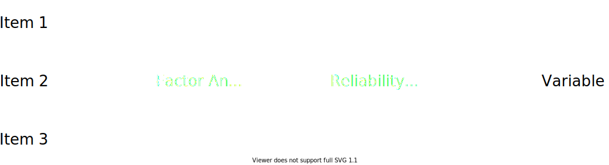
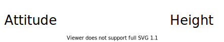
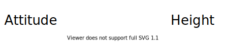
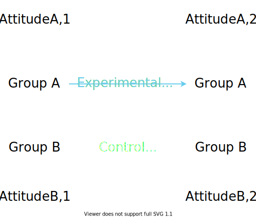
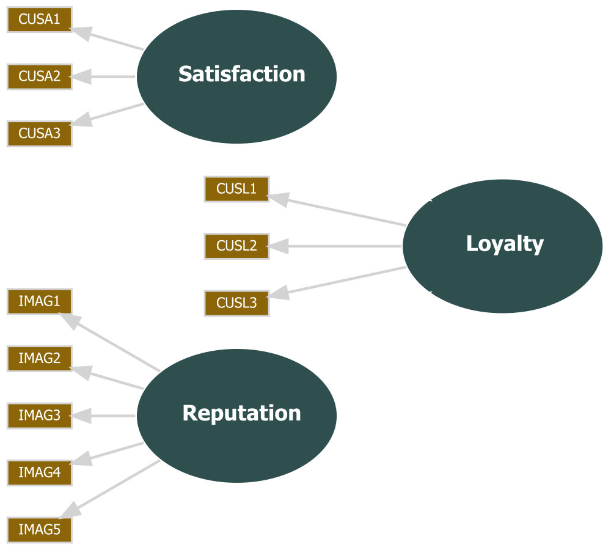
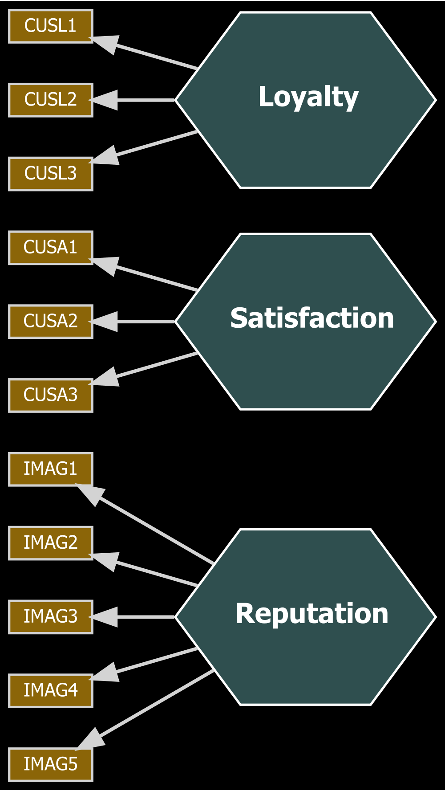
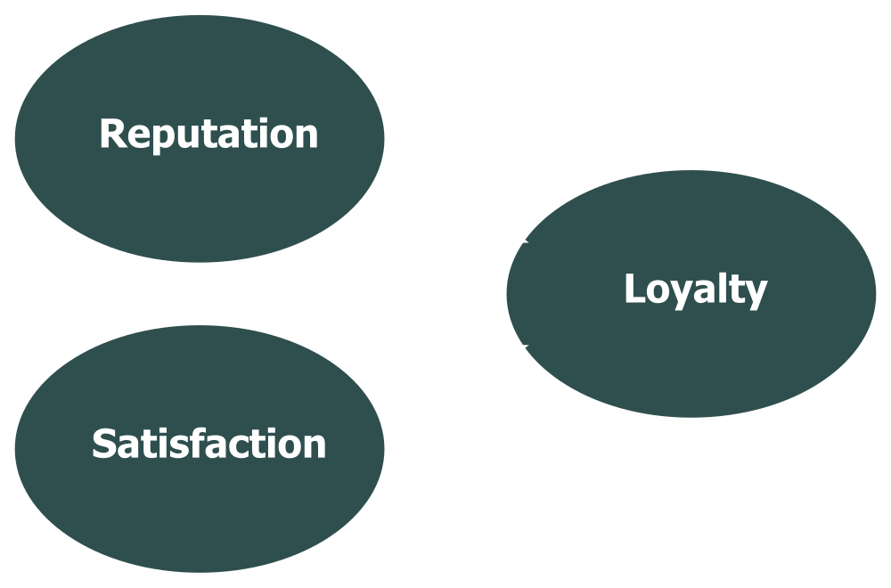

```{r xaringan-themer, include=FALSE, warning=FALSE}
source(here::here("slides", "style.R"))
```


```{r setup, include = FALSE}
library(tidyverse)
library(seminr)
library(jmv)
library(DiagrammeR)
#library(dataforsocialscience)
```

# Welcome

- Structural equation modeling using **SEMinR**

--

- Basic course: 7 videos

--

- Focus on **partial least squares** structural equation modeling (PLS-SEM) - as opposed to **covariance-based** structural equation modeling (CB-SEM)

???

Hello and welcome to our online course on structural equation modeling using SEM-in-R or SEMinR.

In this course, I will take you through the principles and practices of structural equation modeling using the SEM-in-R package for the R Programming language.

-

The basic section of this course is split into seven videos.
They reflect the sequence of steps you will take when designing a structural equation model of your own.
If you are curious for more after that, you are welcome to proceed to the advanced section.
There, I will go into more detail on some of the issues touched upon in the basic section.
I will also describe some more sophisticated modeling techniques.
Before starting with the content of this first video in earnest, I need to add one thing:

-

In structural modeling, there are two main streams.
Partial least squares equation modeling, which is also known as variance-based structural equation modeling, and covariance-based structural equation modeling.
Although you can do both types of modeling in SEMinR, we will focus on PLS-SEM in this series.
Now that is out of the way, let's start with the introduction.

---

# What is Structural Equation Modeling?
1. Why use structural equation modeling, anyway?
2. Properties and components of a structural equation model
3. Process of estimating a model

???

In this video, I will introduce you to structural equation modeling, or SEM, from the perspective of an HCI-researcher or social scientist.
Instead of starting with a definition, I want to take a step back and explain why SEM might be interesting to you. 
Then we will go more into the nitty-gritty.

---

# Why structural equation modeling?

As researchers in HCI or in the social sciences, we study human properties (operationalized as **variables**) and **how** they are related.
- Human variables: Often impossible to measure directly.
- How: Ideally, what causes what?


???

In a very broad sense, we are interested in humans, what they think, their attitudes, their behavior, and their reasons for doing things.
To study humans, we measure variables and examine the relationships between different variables.
And in many cases, we would like to know if variables are related and the direction of the relationship.
We want to know what causes what.

As we study humans, variables are often tough to measure.
Sure, we can measure a person's height pretty easily.
But what about, e.g., their attitude towards smoking?

---

# Why structural equation modeling?

From properties to **variables**...

--

... using survey items:



???

One way to find out a persons' attitude towards smoking is to ask them.
In a scientific context, we tend to use surveys for that.
If you are familiar with survey methodology, you know that to get from individual 
survey questions or items to variables, we have to do multiple steps.

-

Variables are typically constructed from multiple items.
Therefore, we have to conduct a factor analysis and examine reliability.

---

# Why structural equation modeling?
.pull_left[
From association between **variables**...


]


--

.pull-right[
... to causation?


]

???

Now, suppose we have done that for all our survey items and are left with a set of variables.
Can we now find out which variable causes which?

-

The short answer to that is probably not.
To clarify this, let's take a look at a typical regression equation.

---

# Why structural equation modeling?

Regression equations can be reversed.

.pull-left[
### DV is height
$$height = b\times attitude_{smoking} + c$$
]

--

.pull-right[
### DV is attitude towards smoking
$$ attitude_{smoking} = \frac{height - c}{b} $$
]

Both sides are mathematically equivalent.
There is no causation in math.

???

In this linear equation, height is the dependent variable and attitude towards smoking is the independent variable.

-

But if the left side is true, the right side is also true.
There is no causal direction in mathematics.
So we cannot determine if changes in height cause changes in attitude, or vice-versa.
---

# Why structural equation modeling?


.pull-left[


]
.pull-right[
Gold standard of causal statistics: **Randomized control trial**

Changes in $Attitude_{A,2}$ but not in $Attitude_{B,2}$ are **caused** by the experimental intervention
]

???

The gold standard of causal statistics is the randomized control trial.
We have two groups of test subjects that are randomly assigned to a condition.
Here, group A is the experimental group and group B is the control group.
In our example, we want to test the effect of an intervention on a person's attitude towards smoking.
The experimental group is then presented with that intervention.
For example, that might be a message on the dangers of smoking.
The control group is presented with no message at all, or an unrelated message.
Now, we compare the changes in attitude between both groups.
Changes that only occur in the experimental group are likely caused by our intervention.

---
# Why structural equation modeling?

Causal inference and observational data?

--

Causal interpretation is possible **if** 

- there is strong support of that interpretation by theory and previous evidence
- the model design circumvents different interpretations

using causal modeling techniques, e.g., Directed Acyclic Graphs (DAGs) or **Structural Equation Modeling**

Further reading:
Pearl (2012). The Causal Foundations of Structural Equation Modeling.

???

But experiments like these are often neither possible nor practical.
So what can we do if we have only observational data?
As we all know, correlation does not equal causation.
-
But although this topic is somewhat controversial, I do argue that you can relationships in observational data as causal.
For that, two conditions have to be met.
Firstly, the causal relationships you hypothesize should be well-grounded in theory.
And secondly, the model should be designed in way that leaves no room for other interpretations.
One of the techniques that can be used for such causal models is Structural Equation Modeling.
If you are interested in a discussion on the causal interpretation of structural equation models, I recommend the 2012 paper by Pearl shown here.

---

# Properties of a SEM

What are the advantages of structural equation modeling?

Allows for
- causal interpretation
- mediation analysis

Combines

- factor analysis
- regression equation


???

And as it turns out, structural equation models do not only lend themselves to causal interpretation.
They also address another difficulty I mentioned previously:
The way from measurement to variable.
This is done by combining factor analysis - that is, how a variable relates to its measurements - with regression equations - that is, how variables relate to or cause other variables.

---
# Components of a SEM
```{r echo=FALSE, include=FALSE}
thm <- seminr_theme_dark()
thm$construct.compositeA.shape = "ellipse"
thm$plot.bgcolor = "transparent"
seminr_theme_set(thm)
examplemodel <- specify_model(
  measurement_model = constructs(
  composite(construct_name = "Reputation",
            item_names = multi_items("IMAG", 1:5),
            weights = correlation_weights),
  composite("Satisfaction",
            multi_items("CUSA", 1:3),
            mode_A),
  composite("Loyalty",
            multi_items("CUSL", 1:3))
  ),  
  structural_model = relationships(
  paths(
    from = c("Reputation", "Satisfaction"),
    to = "Loyalty")
  )
)
plot(examplemodel)
save_plot("figures/example-model.svg", width = 1000)
```
.pull-left[

]
.pull-right[
<!-- It would be nice to color the text here so it has the same color as the figure, but I failed in my attempts lol -->
- Indicators (manifest variables)
- Constructs (latent variables)
- Measurement model: Relationships between indicators and constructs
- Structural model: Relationships between constructs and other constructs
]

???
To illustrate that, let's look at how a structural equation model might look.
The mustard rectangles represent the so-called indicators.
These are what we actually measured, e.g., the survey items.
The grey ellipses are called constructs, or variables.
The arrows from the constructs to the indicators show the measurement model.
The measurement model defines which construct is made up of which indicators.
The arrows between the constructs make up the structural model.
The direction of the arrow represents the direction of causality.
In this model, we hypothesize that a customer's satisfaction with a company and the company's reputation causes that customer's loyalty.

---
# Components of a SEM: Measurement model
```{r echo=FALSE, include=FALSE}
plot(examplemodel, measurement_only = TRUE)
save_plot("figures/example-model_mm.svg", width = 1000)
```
.pull-left[

]
.pull-right[
Equivalent:

$CUSL1 = \lambda_{1L} \times Loyalty + \epsilon$
$CUSL2 = \lambda_{2L} \times Loyalty + \epsilon$
$CUSL3 = \lambda_{3L} \times Loyalty + \epsilon$

etc.

$\lambda$ = factor loading

$\epsilon$ = error term
]

???

Let's take a closer look at the measurement model.
If we express it mathematically, it's a set of linear regression equations.
Every indicator is regressed on the associated construct.
The coefficient lambda is the factor loading.
Epsilon is the error term.
Before we estimate the model, everything on the right side of the equation is unknown.
We only have values for the indicators.
These values come, for example, from our survey.
Later on, I will introduce different kinds of measurements, but the principle stays the same:
The whole measurement model can be expressed as a set of regression equations.

---

# Components of a SEM: Structural model
```{r echo=FALSE, include=FALSE}
plot(examplemodel, structure_only = TRUE)
save_plot("figures/example-model_sm.svg", width = 1000)
```
.pull-left[

]
.pull-right[
Equivalent:

$Loy. = \beta_{RL} \times Rep. +\beta_{SL} \times Sat. + c + \epsilon$

etc.

$\beta$ = path coefficient

$c$ = intercept

$\epsilon$ = error term
]

???

Now, on to the structural model.
Just as the measurement model, all relationships are regression equations.
As this model is relatively simple, we only have one equation.
Before model estimation, basically everything in this equation is unknown.

---

# How a PLS-SEM is estimated

- Measurement model and structural model are specified
- This results in an **underspecified** system of linear equations
- (Survey) data is provided for all indicators (manifest variables)
- Challenge: Solve underspecified system so it fits each set of responses as well as possible
- System is solved using a **partial least squares** algorithm (PLS-SEM) so the explained **variance** of all latent variables is maximized (variance-based SEM)


???

So, if we take all the equations from the measurement model and structural model together, we have a system of linear equations.
This system is underspecified.
This means that there is more than one possible solution.
More than that, we do have values for some of the variables, specifically the indicators.
But these values are not the same for all our survey respondents - at least, they shouldn't be.
This means we need to find a solution for our equation system that best fits all sets of response data.
And to do that, SEMinR uses an algorithm, a so-called partial least squares algorithm.
Remember in the beginning, when I said that we will focus on partial least squares structural equation modeling, or PLS-SEM?
This is where it gets its name.
By the way, PLS-SEM is sometimes also called variance-based structural equation modeling, or VB-SEM.
This is because when solving the equation system, the algorithm aims for a solution that maximizes the explained variance of the endogenous variables.
We will talk more about explained variance in the model evaluation.

---

# How you estimate a PLS-SEM

- Gather and prepare data
- Specify the measurement model
- Specify the structural model
- Estimate the SEM
- Bootstrap the SEM
- Evaluate the SEM

???

Now that you have had a small glimpse at the principles behind structural equation modeling, let's move on to practice.
The next videos in this course will take you through each step of the estimation process using R and SEMinR.
You start of by gathering and preparing your data.
After, you specify the measurement and the structural model.
Then, you can estimate a model.
To gain further insights about your model, you will bootstrap it.
Finally, you will evaluate your model results.
For each of the bullet points above, we have prepared a video.

Of course, once you move on to your own models, you will start data collection only after you have designed your full model.
Only then will you know what you need to measure.
And often, you will not be done after the first round of model estimation and evaluation.
Instead, you might have to go back and re-specify your model.
But after watching the next videos, you will be well-equipped to do all that and more.

---

# Summary

- Advantages of structural equation modeling
- Composition of a structural equation model
- Steps of the modeling process

???

Let's review.
After watching this video, you now know about the advantages of structural equation modeling.
You know the components of a model and you know how a model is estimated.
You also know which steps a researcher needs to take to get from the data to a model.
Now you're ready to dive into the details of the modeling process.

---
# Sources for this video

Davcik, N. St. (2014). The Use and Misuse of Structural Equation Modeling in Management Research: A Review and Critique. SSRN Electronic Journal. https://doi.org/10.2139/ssrn.2196120

Hair, J. F., Hult, G. T. M., Ringle, C. M., & Sarstedt, M. (2017). A primer on partial least squares structural equation modeling (PLS-SEM) (Second edition). Sage.

Pearl, J. (2012). The Causal Foundations of Structural Equation Modeling: Defense Technical Information Center. https://doi.org/10.21236/ADA557445

Ray, S. & Danks. N. (2020). SEMinR Vignette. https://cran.r-project.org/web/packages/seminr/vignettes/SEMinR.html
