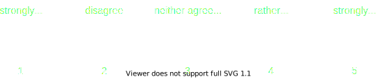
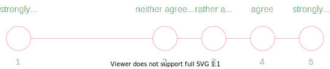
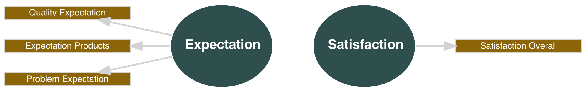
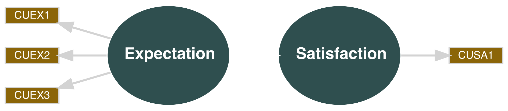

```{r xaringan-themer, include=FALSE, warning=FALSE}
library(seminr)
source(here::here("slides", "style.R"))
```


```{r setup, include = FALSE}
library(tidyverse)
library(seminr)
library(knitr)
library(kableExtra)
options(knitr.table.format = "html")
```

# Data preparation

1. Data requirements
2. Recoding variables 
3. Treating missing values
3. Renaming variables

???

In this video, I will outline the basics of data preparation for SEMinR.
This means making sure that SEMinR is able to interpret your data correctly and is able estimate a model.
I will start by providing an overview of requirements for data to be used in our estimations.
Then I will talk in detail about why and how you should recode and rename variables and treat missing data. 

---

# Data preparation steps

Basic steps:

* Recoding variables
* Treating missing data
* Renaming variables

Advanced steps:

* Examining data distribution
* Removing low quality responses
* Treating outliers

???

Before you can start with model estimation, you have to prepare your data.
As you can see, there are a lot of things you can do with your data before even writing a single line of code.
If you have done statistical analyses before, you will likely be familiar with many of these steps.

In this video, we will focus on basic data preparation.
This means making sure your data can be used by the algorithm to estimate a model.
For the more advanced steps, we will upload separate videos.
Here, I will demonstrate how to do each step using R and the tidyverse.
Of course, if you are used to doing data preparation in another software like SPSS, you are free to keep doing it your way.

---

# Example data

```{r, echo = FALSE, include = TRUE}
dfgoal <- mobi[1:6,1:5]
df <- dfgoal <- mobi[1:6,1:5] %>%
  rename_with(~ c(
    "Quality Expectation",
    "Expectation Products",
    "Problem Expectation",
    "Satisfaction Overall",
    "Expectation Fulfillment"
    ))
df[c(1,4,6),5] <- NA
df[,2] <- df[,2] %>%
  dplyr::recode(
  `7` = "rather agree",
  `9` = "agree",
  `10` = "strongly agree"
)
df[,3] <- df[,3] %>%
  dplyr::recode(
    `5` = 6,
    `6` = 5,
    `7` = 4,
    `9` = 2,
    `10` = 1
  )
df %>%
  kbl() %>% 
  kable_styling()
```


???

Let's assume we start out with data collected in a survey.
Here, we have a small slice of such a data set.

Specifically, this is a modified portion the mobi data set, which is also included in the SEMinR package.
The mobi data set contains data on how satisfied customers are with their mobile phone provider.

Our short example data contains

* 5 variables and
* 6 observations.

The variables are the columns of this table.
Each variable represents a single survey question.
All answers that we have collected to a question are contained in one column.

The observations are the rows of this table.
An observation are all answers a single respondent has given in our survey.
So, what should we do with this data?

---

# Recoding variables: Numerical

```{r, echo = FALSE, include = TRUE}
df %>%
  kbl() %>%
  column_spec(2,
              background = our_red) %>% 
  kable_styling()
```


???

SEMinR relies on your data being numerical.
So, here,  we need to recode the highlighted variable.
But I want to take this opportunity to quickly touch on the way data for a structural equation model should be measured.

---

# Recoding variables: Data type

Data should be

* numerical

But also...


???

As I said, the data should be numerical so that our algorithm can do calculations with it.
But when it does those calculations, there is another implicit assumption about your data.

-

This assumption is that the perceived distance between the numerical values is equidistant, e.g., that the perceived distance between 1 and 2 and between 2 and 3 is roughly the same, like in this example. 

Or to say it differently, the algorithm handles your data as if it were interval scaled.
Now, for many reasons we could argue that it is impossible to collect truely interval scaled survey data.
Still, when you collect your data using Likert scales, or percentages of agreement, you should try and ensure that the scale is, let's say, as equidistant as possible.

--

... approximately equidistant




---

# Recoding variables: Data type

Data should be

* numerical

But also...

... approximately equidistant (i.e., not scaled like this)




???

So try to avoid creating a scale like this.

From this, it also follows that categorical data, such as gender or profession, 
cannot directly be used in PLS-SEM constructs.
If you want to test the influence of such data, you have estimate separate models for each category and then compare them in a multigroup analysis. We will get to this in a later video.

---

# Recoding variables: Data type

Data should be

* numerical
* ordinal scaled
* and the scale should be approximately equidistant

???

So, to summarize:
Your data needs to be numerical, ordinal scaled, and as close to equidistant as possible.

---

# Recoding variables: Data type

```{r, echo = FALSE, include = TRUE}
df %>%
  kbl() %>%
  column_spec(2,
              background = our_red) %>% 
  kable_styling()
```

???

Now, let's take a quick look on what we need to do with our example data if we want to recode it using R.
And of course, there are many ways to do this.

---

# Recoding variables: Data type

```{r}
df <- df %>%                     # assign changes to existing data frame
  dplyr::mutate(                        # add new variable based on existing one
    `Expectation Products` =     # name for the new variable
      dplyr::recode(                    # replace values
        `Expectation Products`,  # variable to replace values in
        "rather agree" = 7,      # old value = new value
        "agree" = 9,
        "strongly agree" = 10
      )
  )
# because we gave the new variable the same name, 
# it replaces the old variable

# use mutate(across(v1:v3), fnc) to recode variables v1 to v3 using fnc
```

???

One relatively quick way is to use the recode() function from the dplyr package combined with the mutate() function.
We can use mutate() to create a new variable called 'Expectation Products'.
Here, it replaces the existing variable of the same name.
We use recode to tell R which answer option should be replaced by which number.
So "rather agree" becomes 7, and "agree" becomes 9. 
If you have a full data set, you will have to assign numbers for each possible answer option.
To recode multiple variables using the same labels at once, 
you can combine the mutate() function with the across() function.

---

# Recoding variables: Data type

```{r, echo = FALSE, include = TRUE}
df %>%
  kbl() %>%
  column_spec(2,
              background = our_blue) %>% 
  kable_styling()
```

???

Much better.

---

# Recoding variables: Direction

```{r, echo = FALSE, include = TRUE}
df %>%
  kbl() %>%
  column_spec(3,
              background = our_red) %>% 
  kable_styling()
```

???

Let's take a look at the next highlighted variable.
This variable is reverse coded.
This means that it has a different direction than its related variables.
Let me illustrate this.

---

# Recoding variables: Direction

```{r, echo = FALSE, include = TRUE}
df %>%
  kbl() %>%
  column_spec(3,
              background = our_red) %>%
  column_spec(1:2,
              background = our_blue) %>%
  add_header_above(
    c(
      "Expectation" = 3,
      "Satisfaction" = 2
    ),
    background = c(our_blue," ")  
  ) %>% kable_styling()
```

???

In our example data, the first three variables are supposed to measure different facets of the same underlying concept - the customer expectation.
Specifically, they are supposed to measure the expectation a customer has of their mobile phone provider.
The first variable refers to overall quality expectations. 
The second variable referst to expectations about products and services.
The third variable - highlighted in red - refers to the expectation of how often problems would occur.
So where high values for the first two variables correspond with positive expectations, a high value for the third variable corresponds with negative expectations.
Often, you can recode your question in advance using the survey software.
But if you haven't, here is how you could do it in R. 

---

# Recoding variables: Direction

```{r eval = FALSE}
df <- df %>%                 # assign changes to existing data frame
  mutate(                    # add new variable based on existing variables
    `Expectation Products` = # name for the new variable
      dplyr::recode(         # replace values
        `1` = 10,            # old value = new value
        `2` = 9,
        `3` = 8,
        `4` = 7,
        `5` = 6,
        `6` = 5,
        `7` = 4,
        `8` = 3,
        `9` = 2,
        `10` = 1
      )
  )
```


???

We can simply use the mutate() and recode() functions again, only with numbers instead of strings.
But there is also a quicker option.

---

# Recoding variables: Direction

Quicker option:

```{r echo = TRUE}
# Reverse scale using mutate() with substraction:
# For a scale ranging from 1 to x: x + 1 - scale
# For a scale ranging from 0 to x: x - scale
df <- df %>%                 
  mutate(
    `Problem Expectation` = 11 - `Problem Expectation`
    )
```

???

You can simply reverse your scale by combining mutate() with some clever math.
Mutate now subtracts each element of my variable from 11.
As my scale ranges from 1 to 10, this gives me the same result as the code on the previous slide.

---

# Recoding variables: Direction

```{r, echo = FALSE, include = TRUE}
df %>%
  kbl() %>%
  column_spec(1:3,
              background =our_blue) %>%
  add_header_above(
    c(
      "Expectation" = 3,
      "Satisfaction" = 2
    ),
    background = c(our_blue, "")  
  ) %>% kable_styling()
```

???

Now, all variables are coded in the same direction.

---

# Treating missing values

```{r, echo = FALSE, include = TRUE}
df %>%
  kbl() %>%
  column_spec(5,
              background = our_red) %>%
  add_header_above(
    c(
      "Expectation" = 3,
      "Satisfaction" = 2
    ),
    background = c("",our_blue)
  ) %>% kable_styling()
```

???

Now, let's take a look at the last variable in our data set.
We have three rows with missing values.
The SEMinR algorithm does not work with missing data.
This means if you have missing data in a variable, SEMinR will by default fill in this values with  substitute data.
Alternatively, you can choose to not use observations that have missing values.
SEMinR has built-in functionality to deal with missing data.
But as both built-in options might drastically influence your model results, 
it still makes sense to consciously decide on how you want to handle missing data in advance.

---

# Treating missing values

```{r, echo = FALSE, include = TRUE}
df %>%
  kbl() %>%
    column_spec(4,
              background = our_blue) %>%
  column_spec(5,
              background = our_red) %>%
  add_header_above(
    c(
      "Expectation" = 3,
      "Satisfaction" = 2
    ),
    background = c("",our_blue)
  ) %>% kable_styling()
```

???

In our example, the last two variables measure facets of satisfaction.
As explained, if you use both variables without doing anything about those missing values...

---

# Treating missing values

```{r, echo = FALSE, include = TRUE}
df_mr <- df
df_mr[c(1,4,6),5] <- round(sum(df[c(2:3,5),5])/3,0)
df_mr %>%
  kbl() %>%
  add_header_above(
    c(
      "Expectation" = 3,
      "Satisfaction" = 2
    )
  ) %>%
  row_spec(c(1,4,6), background = our_blue) %>% 
  kable_styling()
```

???

... SEMinR will by default substitute the missing values with the mean of the variable.
This might reduce variance in the variable and therefore lead to smaller path coefficients.

---

# Treating missing values

```{r, echo = FALSE, include = TRUE}
df %>%
  kbl() %>%
  add_header_above(
    c(
      "Expectation" = 3,
      "Satisfaction" = 2
    )
  ) %>%
  row_spec(c(2:3,5), background = our_blue) %>% 
  kable_styling()
```

???

And if you choose against using mean replacement, only the highlighted observations, or rows, will be used to estimate your model.
In our case, this would mean using only half our data, although the data contains all values for all other variables!
When multiple variables have missing values for different observations, 
the sample size of your model might suddenly be much smaller than expected.
Therefore, you should carefully consider what to do with missing data.

---

# Treating missing values

* Impute missing data
* Remove variables containing missing data (Hair et al., 2017)
* Ignore missing data 


???

If a variable is missing only a small amount of data, you might impute the data.
This means that you replace the missing values with substitute data.
By default SEMinR automatically replaces missing values with the mean value of the variable.
This is called "mean replacement" and it is only one of many methods you can use to create substitute data.
While using mean replacement for missing data will likely not skew the results of your model, it might also make it less likely for you to find significant relationships.

-

Another option is to simply not use the variable containing missing data in your model.
Especially when there is a lot of data missing, this should be your method of choice.
In their 2017 primer on structural equation modeling, Hair et al. name 15 % as the threshold for missing data over which a variable should be removed.

Of course, you can always leave the missing data as-is and tell SEMinR to disregard observations with missing data.
A benefit of this is that SEMinR only drops observations when the missing value would actually be part of the model.
So this option might be beneficial if you try out many different model specifications.

When you are working with a real data set, you will have to weigh the benefits of each option when deciding on how to handle missing data.

Fortunately, for our example, the decision is easy.
Half the data for the variable is missing, so let's get rid of it.

--

```{r}
# remove variable with missing data
df <- df %>%
  select(!'Expectation Fulfillment')
```


---

# Renaming variables

```{r echo = FALSE, include = TRUE}
df %>%
  kbl() %>%
  add_header_above(c("Expectation" = 3,
                     "Satisfaction" = 1)) %>% kable_styling()
```


???

The last point I want to talk about in this video is renaming the variables.
As you can see, the variables in my data set have very descriptive names.
This is useful when we quickly want to see what exactly each variable refers to.
But if you want to use your data in SEMinR, it makes sense to rename them.

---

# Renaming variables

```{r echo=FALSE}
specify_model(
  measurement_model = constructs(
    reflective(
      construct_name = "Expectation",
      item_names = c(
        "Quality Expectation",
        "Expectation Products",
        "Problem Expectation"
      )
    ),
    reflective(
      construct_name = "Satisfaction",
      item_names = c("Satisfaction Overall")
    )
  ),
  structural_model = relationships(paths(from = "Expectation",
                                         to = "Satisfaction"))
) %>%
  plot() -> p
save_plot("figures/long_names.svg", width = 2000)

specify_model(
  measurement_model = constructs(
    reflective(
      construct_name = "Expectation",
      item_names = multi_items("CUEX", 1:3)
    ),
    reflective(construct_name = "Satisfaction",
               item_names = "CUSA1")
  ),
  structural_model = relationships(paths(from = "Expectation",
                                         to = "Satisfaction"))
) %>%
  plot() -> p
save_plot("figures/short_names.svg", width = 2000)

```


.pull-left[
Long variable names...


]


???

Let's take a look at this example path model using our data set.
Variable names are already hard to read. When your model contains more variables, 
you can imagine this gets crowded pretty quickly.

-

Using short abbreviated names improves the readability of the model.
But the main reason for this is that it makes model specification much easier.

--

.pull-right[
... vs. abbreviated names


]


---

# Renaming variables

Long variable names...

```{r echo=TRUE}
measurement_model <- constructs(    # define measurement model
  reflective(                       # define a reflective construct
    construct_name = "Expectation", # construct name
    item_names = c(                 # item names = df variable names
      "Quality Expectation",
      "Expectation Products",
      "Problem Expectation"
    )
  ),
  reflective(
    construct_name = "Satisfaction",
    item_names = c("Expectation Fulfillment")
  )
)
```

???

This is what the SEMinR code would look like for our example.
If this looks complicated, 
don't worry we'll talk about what this code means in our video on the measurement model.
This code is rather lengthy...

---

# Renaming variables

... vs. abbreviated names
```{r echo=TRUE}
measurement_model <- constructs(
  reflective(
    construct_name = "Expectation",
    item_names = multi_items("CUEX", 1:3)    # calls variables with same prefix
  ),
  reflective(construct_name = "Satisfaction",
             item_names = "CUSA1")
)
```


???
While the shorter names make the code more succint and readable.

---

# Renaming variables

... vs. abbreviated names
```{r eval=FALSE}
measurement_model <- constructs(
  reflective(
    construct_name = "Expectation",
    item_names = multi_items("CUEX", 1:3)   #<<
  ),    
  reflective(construct_name = "Satisfaction",
             item_names = "CUSA1")
)
```

???

In SEMinR, you can use the multi_items() function you describe your measurement model.
For this to work, SEMinR assumes that all your variables are named after the pattern "prefix-number".

In our example, we have three variables measuring Expectation.
Therefore, we could rename all variables associated with Expectation to CUEX - for customer experience - and number them from 1 to 3.
Similarly, all variables associated with Satisfaction could be renamed to CUSA - for customer satisfaction - although in our example, there is only one variable left.

For a small model like this, this might seem tedious.
But real-life models will not only contain more variables, but you will almost always have to modify and re-specify them.
In the long run, having renamed the variables will save you a lot of time.

---

# Renaming variables

Rename variables associated with the same construct with the same prefix, e.g. for *CUSA* for *Customer Satisfaction*

```{r}
df <- df %>%
  rename("CUSA1" = "Satisfaction Overall") # new name = old name
```


???

So how would you do it in R?
Again, there are a lot of ways, but one way is using the rename function.
Let's start with the last variable "Satisfaction overall".

But what if we want to rename multiple variables at once?

-

That's easy, too.
We can use rename_with and paste0 to rename them all at once.

--
```{r}
df <- df %>%
  rename_with(~ paste0("CUEX", 1:3), # function to generate new name
              .cols = c(1:3))        # apply to columns 1 to 3
```


---

# Summary

```{r, echo = FALSE}
df %>%
  kbl() %>% 
  kable_styling()
```


* Data is numerical and unidirectional
* There are no missing values
* Variables are named for use in SEMinR 

???

And that's it, you're done with basic data preparation.

Let's review:
To start off, you should take care that you data is coded correctly.
Then you should treat missing data.
Lastly, you should rename your variables so you can easily use them in your SEMinR code.
And then you can move on to model estimation!

---

# Sources for this video

Hair, J. F., Hult, G. T. M., Ringle, C. M., & Sarstedt, M. (2017). A primer on partial least squares structural equation modeling (PLS-SEM) (Second edition). Sage.
