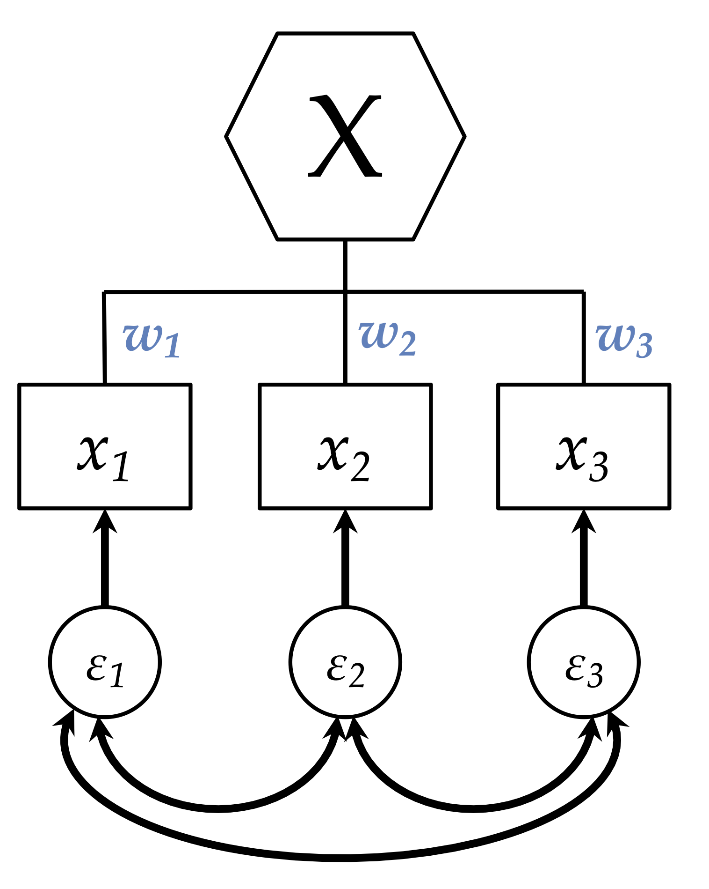
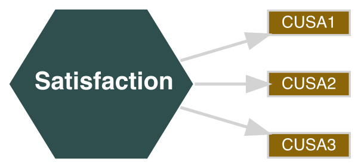
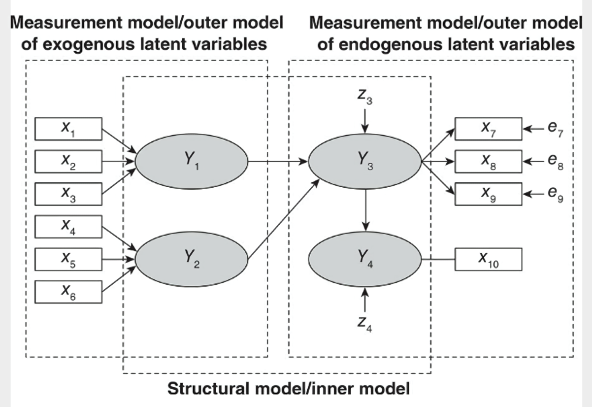

```{r xaringan-themer, include=FALSE, warning=FALSE}
library(seminr)
source(here::here("slides", "style.R"))
```

```{r setup, include=FALSE}
library(tidyverse)
options(htmltools.dir.version = FALSE)
```

# SEM Refresher

- SEMs consist of a structural and a measurement model
- The *structural model* is like the hypothesis
- The *measurement model* connects the hypothesis with the data

--

- There are several philosophies on how to name and measure constructs in PLS-SEM

???

In this video we'll start with model estimation. To get started, we briefly refresh what are the parts of a SEM.
A SEM allows to create complex regression models. Our research hypothesis is typically a set of relationships of latent variables, which we call the structural model. This is sometimes referred to as the path model. The *structural model* is like the hypothesis of our research.

The benefit of SEM is that we not only do we estimate the relationships of latent variables, but we also estimate the latent variables from indicators in our data in one go.
How latent variables are estimated from their indicators is defined in the measurement model.
The *measurement model* connects the hypothesis with the data.

-

There are several philosophies on how to name and measure constructs in PLS-SEM.
On a high level, we differentiate between factor-models and composite models.
In this basic tutorial we focus on composite measurements. 
You will hear about reflective measurement in the advanced tutorials.

---


# The Composite Measurement Model:

* defines how to measure the latent variables (constructs)
* mode A (correlation weights)
* mode B (regression weights)

--

**Terminology hint**

SmartPLS refers to mode A as reflective and mode B as formative

???

The measurement model specifies how we measure the latent variables (constructs).
Within composite measurement, we distinguish two ways to measure latent variables: mode A and mode B measurement. 
Mode A is also referred to as correlation weights and mode B as regression weights.


In the SmartPLS terminology mode a refers to reflective measurement, while mode B refers to formative measurement. However, terminologies differ depening on who you ask.

For this tutorial we stick with mode A and mode B as it is used in SEMinR.


---
# What's the difference between A and B?

.pull-left[
* Items are the nature of the composite
* Construct is composed of weighted items

]

.pull-right[
.width-60[
  
]
]

???

HELP-Lilian?


---

# Mode A measurement:

```{r echo=FALSE, include=FALSE}
p <- plot(constructs(
  composite("Satisfaction", multi_items("CUSA", 1:3), weights = mode_A)
))
fname <- here::here("slides", "basics", "figures", "mode_a.svg")
save_plot(fname, width = 600)
```

.pull-left[

Satisfaction uses a **mode A** measurement

Arrows point **from the construct** to the indicator.

Composites use **hexagons** in SEMinR.
]
.pull-right[


]


???

In this figure, the construct Satisfaction uses a mode A measurement model. 
The arrows point from the construct to the indicator variables (here CUSA1-CUSA3).

In SEMinR composite measurement is shown in the construct as a hexagon.
This is to differentiate it from reflective measurement as it is used in 
covariance-based SEM or consistent PLS (more on that in that advanced series).

Other software might show composite measurement as ellipses (e.g. SmartPLS).

---
# Mode A in SEMinr

```{r}
measurement_model <- constructs( #<<
  composite("Satisfaction", multi_items("CUSA", 1:3), weights = mode_A), 
  composite("Loyalty", single_item("CUSL"))
)
```

???

The measurement model is created using the constructs function. 


---
# Mode A in SEMinr

```{r}
measurement_model <- constructs( 
  composite("Satisfaction", multi_items("CUSA", 1:3), weights = mode_A), #<<
  composite("Loyalty", single_item("CUSL"))
)
```

???

To create a composite in our measurement model we use the composite function.
We use multi_items to use several items that have a name like CUSA1 CUSA2, CUSA3
TODO

---
# Mode A in SEMinr

```{r}
measurement_model <- constructs( 
  composite("Satisfaction", multi_items("CUSA", 1:3), weights = mode_A),
  composite("Loyalty", single_item("CUSL")) #<<
)
```

???

Create single item composites using the single_item function
TODO


---

# Mode B measurement:

```{r echo=FALSE, include=FALSE}
p <- plot(constructs(
  composite("Satisfaction", multi_items("CUSA", 1:3), weights = mode_A)
))
fname <- here::here("slides", "basics", "figures", "mode_b.svg")
save_plot(fname, width = 600)
```

.pull-left[

Satisfaction uses a **mode B** measurement

Arrows point **from the indicators** to the construct

Composites use **hexagons** in SEMinR.
]
.pull-right[



]


???

TODO: CHECK ARROW DIRECTION IN SEMinR

In this figure, the construct Satisfaction uses a mode B measurement model. 
The arrows point from the construct to the indicator variables (here CUSA1-CUSA3).

In SEMinR composite measurement is shown in the construct as a hexagon.
This is to differentiate it from reflective measurement as it is used in 
covariance-based SEM or consistent PLS (more on that in that advanced series).

Other software might show composite measurement as ellipses (e.g. SmartPLS).

---


# The measurement model



???

In this figure, the constructs Y1 and Y2 are based on a formative measurement model. 
The arrows point from the indicator variables (here X1-X3 for Y1 and X4-X6 for Y2) to the constructs. 
This implies a causal and predictive relationship in this direction.

// Causal Indicators (with error term) and Composite Indicators (no error term)

---


# The measurement model - reflective measurement:


???

In contrast, Y3 and Y4 are based on a reflective measurement model. 
In reflective measurement models, the arrows point from the constructs to the indicators.
Thus, the construct causes the measurement of the indicator variables or more specific of their covariance. 

The Figure shows also, that for reflective measurement each indicator has an error term. 
In contrast, formative measurements have no error terms. 
We assume, that formative measurements are without error.

In this example, Y4 is measured with only one item instead of multiple items. 


---
# Overview of Measurement Terminologies

Table SmartPLS SEMinR 

```{r echo=FALSE}
measurement_model <- constructs(
  composite("Satisfaction", multi_items("CUSA", 1:3), weights = mode_A), 
  composite("Loyalty", single_item("CUSL"), mode_A)
)
structural_model <- relationships(
  paths("Satisfaction", "Loyalty")
)
plot(specify_model(measurement_model, structural_model))

```

???
TODO 
LILIAN-HELP - Screenshot vom Model aus SmartPLS ?


---

# Summary

Composite vs Factor

Mode A vs Mode B

Next is defining the structural model

---

# References

Henseler, J. 2017. “Bridging Design and Behavioral Research With Variance-Based Structural Equation Modeling,” *Journal of Advertising* (46:1), pp. 178–192.

Sarstedt, M., Hair, J. F., Ringle, C. M., Thiele, K. O., and Gudergan, S. P. 2016. “Estimation issues with PLS and CBSEM: Where the bias lies!,” *Journal of Business Research* (69:10)

