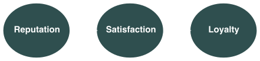
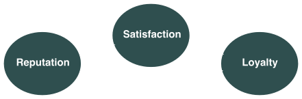

```{r xaringan-themer, include=FALSE, warning=FALSE}
library(seminr)
source(here::here("slides", "style.R"))
```

```{r setup, include=FALSE}
options(htmltools.dir.version = FALSE)
```

# Start Defining your model

- Finished data preperation
- Reminder Structural and Measurement model

Let's start with the Structural model
- This is your hypothesis


# The structural model:

- describes relationship between latent variables
- order and sequence of constructs: based on theory/ experiences and knowledge
- path-models from left to right
 - left: independent variables
 - right: dependent variables
 - left: sequential ahead, influence variables on the right
 
 
???

Script not ready yet

---

# The structural model 2 - exogeneous vs. endogeneous variables:

- variables can serve as dependent and independent
- latent variables serving only as independent = exogeneous latent variables (Y1 and Y2)
- latent variables serving only as dependent (Y4) or as independent and dependent (Y3) = endogeneous latent variables (Y3)
- each variable, which has only arrows coming from it = exogeneous latent variable
- endogeneous latent variables can have either incoming and outgoing arrows (Y3) or only incoming arrows (Y4)
- exogeneous latent variables have no error terms (because these constructs depict the independent variables explaining the dependent variables in the path-model)

---

# Specification of structural model:
- When developing a structural model, two things must be considered:
1. sequence of the constructs
2. relationships between constructs
- both represent hypotheses and the theory to be tested (must be reflected during development of model)

---

## Sequence of constructs:
- based on theory/ concept, logic/ experiences
- from left to right: left: independent (explanatory) constructs > dependent constructs (outcomes)
- assumes, that constructs on the left are ahead and that they predict variables on the right
- constructs only serving as independent variables = exogeneous latent variables; at the left side; have only arrows coming from it
- constructs serving as dependent variables = endogeneous latent variables; at the right side; only incoming arrows
- constructs serving as independent and dependent variables = endogeneous variables; in the middle of the path-model


```{r echo=FALSE, eval=FALSE}
relationships(
  paths(
    from = "Reputation",
    to = c("Satisfaction")
  ),
  paths(
    from = "Satisfaction",
    to = "Loyalty"
  )
) %>% plot() -> p
save_plot("figures/simplemodel.svg")
```




---

## Determining sequence of constructs:
- hard: contradictory theoretic perspectives imply different sequences 
- should always be based on theory and logic
- contradictory perpectives: personal judgement 
- possible: competing models

---

## Relationships between constructs:
- specified by arrows
- generally the tip points to the right
- directed relations: called causal, when supported by theory
- conflict: completeness (all relations supported by theory) and sparsity (few relations)
- sparsity: not everything should explain everything
- mostly, linear relationships between two or more constructs within one path-model
- more complex modell relationships: mediations; moderations (next slides)

---

## Mediation:
- mediating effect: third construct occurs between two other related constructs
- e.g. model with direct and indirect effects:
- direct effects: two constructs are related by only one arrow
- indirect effects: related by a sequence of relationships with at least one mediating construct
- indirect effects: sequence of two or more direct (indicated by arrows) effects = mediating effect

```{r echo=FALSE, eval=FALSE}
relationships(
  paths(
    from = "Reputation",
    to = c("Satisfaction", "Loyalty")
  ),
  paths(
    from = "Satisfaction",
    to = "Loyalty"
  )
) %>% plot() -> p
save_plot("figures/mediation.svg")

```


---

## Mediation:
- most common used for "explanation" why a relation between an exogeneous and an ednogeneous construct exists
- (e.g. one observes a relation between two constructs, but is unsure "why" this relation exist or if the relation is the only possible relation between the constructs)


