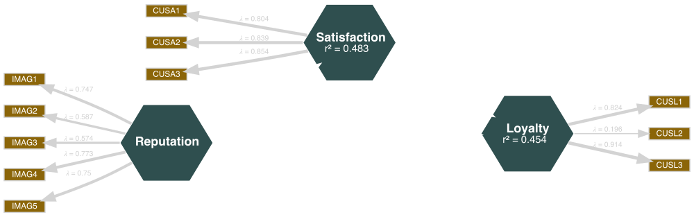

```{r setup, include = FALSE}
library(tidyverse)
library(seminr)
library(knitr)
options(htmltools.dir.version = FALSE, htmltools.preserve.raw = FALSE)
```
# PLS model estimation in SEMinR

1. Before estimation
2. Estimating a model
3. The SEMinR model object
4. Troubleshooting


???
Now that you know how to specify the measurement model and the structural model in SEMinR, all that is left is model estimation.
In this video, I will show you how to estimate a PLS SEM model in SEMinR.
I will also talk about the model object in SEMinR and what you can do with it.
Finally, I will adress some common problems that appear when you estimate a model.

---

# Before estimation

What you need to estimate a model:
* Data
* Measurement model
* Structural model

???
Before we start with estimation, let's shortly talk about the ingredients you need to estimate a model. 
Firstly, you need a data set as described in our video on data preparation.
This data set can be both in the matrix or dataframe format and must contain numerical response data.
With PLS-SEM, model estimation is possible even with a small number of observations.
But of course, if you have more responses, your model's statistical power is larger.
Secondly, you need to specify a measurement model.
The measurement model is the link between your data and your structural model.
A common source of trouble is a disconnect between measurement model and either data or structural model.
For example, if the indicator names in your measurement model don't correspond with the column names in your data,
or when you use a construct in your structural model that you have not defined in your measurement model.
Thirdly, in your structural model you the relationship between the model constructs.

---

# Before estimation - example

```{r, include = TRUE}
library(seminr)
dt <- mobi
mm <- constructs(
  composite(construct_name = "Reputation",
            item_names = multi_items("IMAG", 1:5),
            weights = correlation_weights),
  composite("Satisfaction",
            multi_items("CUSA", 1:3),
            mode_A),
  composite("Loyalty",
            multi_items("CUSL", 1:3))
)
```


???
For our example, we use the mobi data set which is part of the seminar package.
We assign the new name dt to the mobi data set.
As example model, we use the mediation model from our structural model tutorial.
For that, we define all constructs in the measurement model which we call mm.
As you have learned in the measurement model tutorial, the code for all three constructs is equivalent. They each define a mode a (or correlation weights) composite construct.


---

# Before estimation - example

```{r}
sm <- relationships(
  paths(
    from = "Reputation",
    to = c("Satisfaction", "Loyalty")
  ),
  paths(
    from = "Satisfaction",
    to = "Loyalty"
  )
)
```

???
Lastly, we define the structural model which we call sm.

---

# Before estimation - example

```{r eval=FALSE}
specify_model(measurement_model = mm,
              structural_model = sm) %>%
  plot()
```
--
```{r echo=FALSE, include = TRUE}
specify_model(measurement_model = mm,
              structural_model = sm) %>%
  plot() -> p
save_plot("figures/estimated_mediation.svg", width = 1000)
```



???
Now, we are ready for model estimation.
But we can also take a quick peek on how our model looks.
For this, you can use the specify_model function with your measurement model and your structural model and pipe it into the plot function.
(Next slide part)
Looks about right.
As you can see, by default SEMinR visualizes composite constructs as hexagons.

---

# Estimating a model

```{r eval=FALSE}
model <- estimate_pls(
  data = dt,
  measurement_model = mm,
  structural_model = sm,
  model = NULL,
  inner_weights = path_weighting,
  missing = mean_replacement, 
  missing_value = NA
)
```

???
Now it's time for model estimation!
The estimate_pls function takes eight arguments.
On a regular basis, you will likely only use these first three.
Let me still quickly take you through all of them.

---

# Estimating a model - the fundamentals

```{r eval=FALSE}
model <- estimate_pls(
  data = dt,                #<<
  measurement_model = mm,   #<<
  structural_model = sm,    #<<
  model = NULL,
  inner_weights = path_weighting,
  missing = mean_replacement, 
  missing_value = NA
)
```
--
Equivalent code:
```{r eval=FALSE}
model <- estimate_pls(
  dt,
  mm,
  sm
)
```

???
As mentioned, these three are likely the only arguments you will need.
The first argument asks for the data, the second for the measurement model and the third for the structural model.
(Next slide part)
Without these three inputs, SEMinR cannot estimate your model.
But these three inputs are also sufficient to estimate the model, so normally, you can just give these inputs to the estimate_pls function without specifying which argument is which.
This means, that the bottom code is equivalent to to the top code.

---

# Estimating a model - *model*

```{r eval=FALSE}
model <- estimate_pls(
  data = dt,                
  measurement_model = mm,   
  structural_model = sm,
  model = NULL,    #<<
  inner_weights = path_weighting,
  missing = mean_replacement, 
  missing_value = NA
)
```
--
```{r eval=FALSE}
specified_model <- specify_model(
  measurement_model = mm,
  structural_model = sm
  )
```


???
Instead of providing a measurement model and structural model, you can also specify a model with the specify_model function.
(Next slide part)
We just used this to quickly plot our model, remember?
So either you provide the measurement model and structural model directly to the estimate_pls function, or you specify the model before.
By default, this argument is set to NULL.

---

# Estimating a model - *inner_weights*

```{r eval=FALSE}
model <- estimate_pls(
  data = dt,                
  measurement_model = mm,   
  structural_model = sm,
  model = NULL,
  inner_weights = path_weighting,    #<<
  missing = mean_replacement, 
  missing_value = NA
)
```
--
Further reading:
Tenenhaus et al. (2005). PLS path modeling.

???
The inner_weights argument defines how paths are estimated by the algorithm.
By default, this is set to path weighting which is the recommended option for most models.
The other option is factor weighting.
(New slide part)
When estimating a model, the results for both options will be very similar.
If you are interested in the differences between these two schemes, I recommend the 2005 PLS path modeling paper by Tenenhaus et al.

---

# Estimating a model - *missing*

```{r eval=FALSE}
model <- estimate_pls(
  data = dt,                
  measurement_model = mm,   
  structural_model = sm,
  model = NULL,
  inner_weights = path_weighting,
  missing = mean_replacement,     #<<
  missing_value = NA              #<<
)
```
--
Alternatively: Disregard observations with missing values
```{r eval=FALSE}
model <- estimate_pls(
  data = dt,                
  measurement_model = mm,   
  structural_model = sm,
  model = NULL,
  inner_weights = path_weighting,
  missing = na.omit,     #<<
  missing_value = NA              #<<
)
```

???
These arguments let you specify how SEMinR handles missing data.
As described in our data preparation basics video, missing data means that in a variable, or column of your data set, some values are missing.
By default, SEMinR uses mean replacement.
That means that SEMinR replaces missing values in a column of your dataset with the mean of that column.
As discussed, this might not always be the best option.
If you want SEMinR to disregard observations with missing values, choose the na.omit option.
The second argument, missing_value, just tells SEMinR what missing values look like in your data.
If you have formatted your data as numerical, it will be called NA anyway.

---

# Estimating a model 


```{r}
model <- estimate_pls(
  data = dt,                
  measurement_model = mm,  
  structural_model = sm
)
```

???
Now that we have talked through all arguments, let's run the code.
If everything goes according to plan, your code output will look like this and tell you the number of observations.
If your model includes higher-order constructs or interaction terms, this will print twice because a first-stage model is estimated separately.
(Next slide part)
We can now plot our model to get a quick overview of our model results.

---

# The SEMinR model object - plot

```{r}
plot(model)
```

???
Now, we have a model object, what do we do with it?
We have separate videos on model evaluation and bootstrapping, so let's just take a quick peek at the model object itself.
Firstly, we can of course plot it.
(Next slide part)
By default, the contains both the measurement and the structural model with path coefficients, weights and loadings as well as the explained variance R^2.

---

# The SEMinR model object - subobjects

```{r eval=FALSE}
> model$
```
--
Means of all indicators:
```{r}
model$meanData
```
--
Number of iterations until convergence:
```{r}
model$iterations
```
And many more!

???
If you type in model and then the dollar sign, you get an overview of the information and objects stored in the pls model object.
(Next slide part)
For example, meanData contains the means of all indicators.
(Next slide part)
Iterations is the number of iterations it took until the algorithm converged.

---

# The SEMinR model object - summary

```{r}
summary(model)
```

???
The summary function gives you a quick overview of your model results.
If you just execute summary function, R prints a table with path coefficients and R^2.
It also prints a table with criteria for internal consistency reliability and convergent validity.

---

# The SEMinR model object - summary subobjects

```{r}
summarymodel <- summary(model)
```
--
Informations on discriminant validity:
```{r}
summarymodel$validity$vif_items
```

And many more!

???
If you store the model summary in a separate object, you can access much more information. For example...
(Next slide part)
You can access discriminant validity criteria like the variance inflation factor

---

# Troubleshooting - *'x' must be numeric*

```{r}
dt2 <- dt %>%
  mutate(IMAG1 = IMAG1 %>%
           as.character())
```
--
```{r eval=FALSE}
estimate_pls(dt2, mm, sm)
```
```
Generating the seminr model
argument is not numeric or logical: returning NA
All 250 observations are valid.
Error in colMeans(x, na.rm = TRUE) : 'x' must be numeric
```

--
```{r eval=FALSE}
dt2 %>% select(!where(is.numeric))
```

--


???
Finally, let's look at three common problems that can happen when estimating a model.
First, let's assume our data is not numerical.
For that, I make a new data set with one of our indicators formatted as a character.
What happens if I try to estimate our model with that data?
(Next slide part)
I get an error that looks something like that, telling me that my data is not numeric.
So if you get an error that looks like this, you need to go back and reexamine your data.
(Next slide part)
For example, you can select all the columns that are not numeric using the select function, the where function negated with a ! operator and the is.numeric function.

---
# Troubleshooting - *undefined columns selected*

```{r}
mm2 <- constructs(
  composite(construct_name = "Reputation",
            item_names = multi_items("IMGA", 1:5), #<<
            weights = correlation_weights),
  composite("Satisfaction",
            multi_items("CUSA", 1:3),
            mode_A),
  composite("Loyalty",
            multi_items("CUSL", 1:3))
)
```
--
```{r eval=FALSE}
estimate_pls(dt, mm2, sm)
```
```
Error in `[.data.frame`(data, , mmMatrix[which(!grepl("\\*", 
mmMatrix[, : undefined columns selected
```

???
Second, what happens if I try to access a column that is not in my data?
Especially with large measurement models, typos are prone to happen.
So if I mistype the *Image* suffix to I-M-G-A and try to estimate the model
(Next slide part)
The resulting error tells me that R could not find the columns I tried to select in my data.
Unfortunately, I have not yet found a shortcut to correct this.
As far as I know, you have to scrutinize every line of your measurement model and compare it with the column names in your data.

---
# Troubleshooting - *attempt to apply non-function*

```{r}
sm2 <- relationships(
  paths(
    from = "Reputation",
    to = c("Satisfaction", "Loyalty")
  ),
  paths(
    from = "Satisfaction",
    to = c("Loyalty", "Quality") #<<
  )
)
```
--
```{r eval=FALSE}
estimate_pls(dt, mm, sm2)
```
```
Generating the seminr model
All 250 observations are valid.
Error in measurement_mode_scheme[[i]](mmMatrix, i, normData, 
construct_scores) : attempt to apply non-function
```

???
The last common error happens when I try to include a construct in my structural model that I have not defined in my measurement model.
Let's assume I want to include a construct called quality.
If I just put it into my structural model without defining how it should be measured...
(Next slide part)
... the error message will tell me that I attempted to apply a non-function.
Again, there is not really a quick way to find the culprit construct.
But if you get an error message like this, you now know where to start looking:
Which construct in your structural model is not defined in your measurement model?
---

# Summary

* Model estimation with estimate_pls()
* Model object and model summary object
* Common errors

???
To finish off, let me review the contents of this video.
You now know how to estimate a PLS model in SEMinR.
You also know how to examine the model you have estimated.
And you are familiar with common errors that can happen when you estimate a model.
Now you're ready to move on to model evaluation!

---

# Sources for this video

Hair, J. F., Hult, G. T. M., Ringle, C. M., & Sarstedt, M. (2017). A primer on partial least squares structural equation modeling (PLS-SEM) (Second edition). Sage.

Henseler, J., Ringle, C. M., & Sinkovics, R. R. (2009). The use of partial least squares path modeling in international marketing. In R. R. Sinkovics & P. N. Ghauri (Eds.), Advances in International Marketing (Vol. 20, pp. 277–319). Emerald Group Publishing Limited. https://doi.org/10.1108/S1474-7979(2009)0000020014

Ray, S. & Danks. N. (2020). SEMinR Vignette. https://cran.r-project.org/web/packages/seminr/vignettes/SEMinR.html

Tenenhaus, M., Vinzi, V. E., Chatelin, Y.-M., & Lauro, C. (2005). PLS path modeling. Computational Statistics & Data Analysis, 48(1), 159–205. https://doi.org/10.1016/j.csda.2004.03.005
