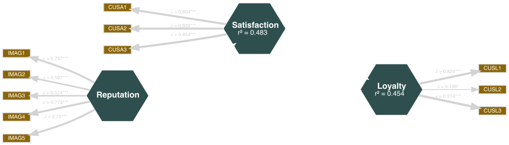

```{r xaringan-theme, include=FALSE, warning=FALSE}
library(seminr)
source(here::here("slides", "style.R"))
```


```{r setup, include = FALSE}
library(tidyverse)
library(seminr)
library(knitr)
options(htmltools.dir.version = FALSE, htmltools.preserve.raw = FALSE)
```
# PLS model estimation in SEMinR

1. Why we bootstrap
2. Bootstrapping a model
3. The SEMinR bootstrapped model object

???

After watching the previous videos, you now know how to prepare your data and how to specify and estimate a model.
The next step is bootstrapping that model for significance.

---

# Why we bootstrap

Bootstrapping gives you significance information for

* path coefficients
* weights
* loadings
* HTMT ratios

--
... given your data

???

Bootstrapping means that your model is re-estimated a large number of times.
You can then analyse and compare the results from the different estimations.
This gives you information about how likely your original model results are given your data.
Specifically, from the results, SEMinR automatically construct confidence intervals and calculate t-values for all values in your model.
That means path coefficients, but also weights, loadings and HTMT values.
In short,
Note that this doesn't say anything about how likely it is to replicate your model results in the general population.


---

# Bootstrapping a model - preparation 

```{r}
# load seminr library
library(seminr)
# quickly estimate model
model <- estimate_pls(
  data = mobi,
  measurement_model = constructs(
  composite("Reputation", multi_items("IMAG", 1:5)),
  composite("Satisfaction", multi_items("CUSA", 1:3)),
  composite("Loyalty", multi_items("CUSL", 1:3))),
  structural_model = relationships(
  paths(from = "Reputation", to = c("Satisfaction", "Loyalty")),
  paths(from = "Satisfaction", to = "Loyalty"))
)
```


???
I will use the same model as in the model estimation tutorial.
We use the mobi dataset again, and specify the measurement model and structural model directly in the estimate_pls() function. 


---

# Bootstrapping a model - the fundamentals

```{r eval=FALSE}
# bootstrap the model
bootstrapmodel <- bootstrap_model(
  seminr_model = model,   # a pls model #<<
  nboot = 500,            # the number of bootstrap iterations #<<
  cores = NULL, 
  seed = NULL
  )
```

???

Now, we can take that model and bootstrap it.
As you can see, the bootstrap_model() function takes four arguments.
Let's start of with the first two arguments.
For seminr_model, you of course provide the model you want to bootstrap.
This needs to be a model object which is generated by the estimate_pls() function.
It is also the only argument you must provide to the function for it to run.
All other arguments are optional.
In the second argument, you specify the number of bootstrap iterations.
If you don't specify a number, the function defaults to 500.
Model bootstrapping takes a lot of resources, so this is fine for testing out different models.
If you want to publish your model results, the recommended number of bootstrap iterations is 5000.

---

# Bootstrapping a model - *cores* and *seed*

```{r eval=FALSE}
# bootstrap the model
bootstrapmodel <- bootstrap_model(
  seminr_model = model,
  nboot = 500,
  cores = NULL,           # the maximum number of cores to use #<<   
  seed = NULL             # the random seed #<<
  )
```

???

The next two arguments are *cores* and *seed*.
For the argument cores, you can specify the maximum number of cores R may use to bootstrap your model.
By default, bootstrap_model() will use all available cores.
Lastly, you can specify a seed.
This is a number that will be used to initialize a pseudorandom number generator which is used for the function.
If you provide a seed, others can reproduce your results exactly because the pseudorandom number generator will give them the same number sequence.
By default, the value is NULL.

---

# Bootstrapping a model

```{r}
# bootstrap the model
bootstrapmodel <- bootstrap_model(
  seminr_model = model,
  nboot = 100
  )
```

???

Now that we have talked through the code, I will actually bootstrap our model.
To save computing time, I have set the number of bootstrap iterations to 100.
And as you can see, the model was successfully bootstrapped.
Next, let's look at what we can do with the boostrapped model object.

---

# The SEMinR bootstrap model object - plot

```{r echo = FALSE}
plot(bootstrapmodel) -> p
save_plot("figures/boostrapped_mediation.svg", width = 1000)
```
```{r eval = FALSE}
plot(bootstrapmodel)
```


???

Just like with the model object, we can of course also plot the bootstrapped model.
Compared to the plot of the regular model, there are two additions:
First, all path coefficients as well as loadings and weights have asterisks that show significance.
Second, there are confidence intervals for the path coefficients.

---

# The SEMinR bootstrap model object - plot


--
.pull-left[
$^{***}p <.001$, $^{**}p <.01$, $^{*}p <.05$
]
--
.pull-right[
95% CI[lower bound, upper bound]
]

???

Let's take a closer look.

-

The asterisks indicate the p level of significance.
The p value is calculated based on the t value from the bootstrapping procedure and the degrees of freedom which are equal to the number of observations you have in your data set.
As is common practice, three asterisks indicate a p which is smaller than .001.
Two asterisks indicate a p which is smaller than .01 and one asterisk indicates a p which is smaller than .05.

-

The 95 % confidence interval tells you the interval in which 95 % of the bootstrap model results for the path coefficient fall.
The first value is the lower bound.
2.5 % of the bootstrap result values is smaller than this lower bound.
And the second value is the upper bound, meaning that 2.5 % of results are larger than this bound.
This gives you more information on how likely it is to get your model results, given the data.

---

# The SEMinR bootstrap model object - subobjects

```{r eval=FALSE}
> bootstrapmodel$
```
--
Example: Path coefficients for all iterations:
```{r}
bootstrapmodel$boot_paths
```


???

As with the pls model object, the bootstrapped model object also contains a lot of subobjects.
If you type in bootstrapmodel with a dollar sign, you get an overview of the information and objects stored in the bootstrapped model object.
Some of that information is simply inherited from the model object, other information is generated in the bootstrapping process.

-

However, if you call that information directly from the bootstrap model object, it will give you the results for each bootstrapping iteration.
For example, this means there are 100 entries if we want to look at the results for the path coefficients alone.


---

# The SEMinR bootstrap model object - summary

```{r}
# print summary of the bootstrapped model
summary(bootstrapmodel)
```

???

Thankfully, the summary function again gives us a concise overview of the bootstrap results.
But in comparison to the pls model summary, executing the summary function on a bootstrapped model gives us a lot more information.
Too much information, again, to fit on this slide.
---

# The SEMinR model object - summary subobjects

```{r}
# save summary of the bootstrapped model
summarybootmodel <- summary(bootstrapmodel)
```
--
```{r}
# number of bootstrap iterations
summarybootmodel$nboot
```

???

So let's store the summary in a object again and look at the different parts.
The summary of the bootstrapped model contains six objects which are interesting to us:

-

First, we can again look up how many times the model was bootstrapped.

---

# The SEMinR model object - summary subobjects

```{r}
# bootstrapped paths
summarybootmodel$bootstrapped_paths
```


???
But we are probably more interested in the results of the bootstrapping procedure.
Let's look at the results for the path coefficients.
All boostrap results are formatted as a table.
In the first column, you can see the original estimate for the path coefficient.
The second and third column show the mean and standard deviation of the distribution of all path coefficients calculated during bootstrapping.
The fourth column contains the t statistic which is an indication of significance.
As the underlying t-test is two-tailed, a t statistic of at least 1.65 indicates a significance level of 10 %.
The last to columns contain the lower and upper bound of the 95 % confidence interval.

---

# The SEMinR model object - summary subobjects

```{r eval=FALSE}
# bootstrapped weights
summarybootmodel$bootstrapped_weights
# bootstrapped loadings
summarybootmodel$bootstrapped_loadings
# bootstrapped HTMT
summarybootmodel$bootstrapped_HTMT
```
```{r}
# bootstrapped total paths - includes mediated influence
summarybootmodel$bootstrapped_total_paths
```

???

The same information is available for the weights, the loadings, the heterotrait-monotrait ratio and the total paths.
The results are all formatted using the same table structure.
The difference between paths and total paths is that total paths include mediated influence.
In our model, Reputation has a direct path to Loyalty but also a path that is mediated by Satisfaction.
Therefore, the coefficient for the total path of Reputation on Loyalty is larger.


---

# Summary

* Why we bootstrap
* Model bootstrapping with bootstrap_model()
* Bootstrapped model object and boostrapped model summary object

???

To finish off, let me review the contents of this video.
You now know why you should bootstrap your model and how to do it in SEminR.
You also know how to plot and examine the bootstrapped model.
With this, you're ready to move on to model evaluation!

---

# Sources for this video

Hair, J. F., Hult, G. T. M., Ringle, C. M., & Sarstedt, M. (2017). A primer on partial least squares structural equation modeling (PLS-SEM) (Second edition). Sage.


Ray, S. & Danks. N. (2020). SEMinR Vignette. https://cran.r-project.org/web/packages/seminr/vignettes/SEMinR.html
