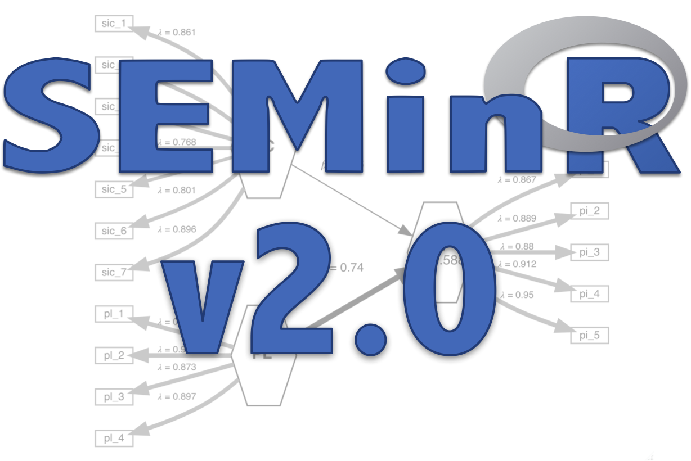

```{r setup, include=FALSE}
library(knitr)
library(rmdformats)

## Global options
options(max.print = "75")
opts_chunk$set(echo = FALSE,
	             cache = TRUE,
               prompt = FALSE,
               tidy = TRUE,
               comment = NA,
               message = FALSE,
               warning = FALSE)
opts_knit$set(width = 75)


htmltools::tagList(rmarkdown::html_dependency_font_awesome())
```



# Welcome to learning SEM using SEMinR

Hello and welcome to this website. On this website, we will organize content and videos
that together form the course Learning SEM using SEMinR.

Please be aware that this course is still under development and not all information will be available from the start.
To stay updated on the course, you can follow the official SEMinR Twitter account at: [https://www.twitter.com/sem_in_r](https://www.twitter.com/sem_in_r). 

# Get started
Ideally, you should be familiar with the R programming language. In this course, we use the tidyverse style of doing things.
This means being familiar with data pipelines and the `dplyr` package is really helpful.

If you are not familiar with the tidyverse we recommend the R for Data Science course by Hadley Wickham and Garret Grolemund.
You can find the book at [https://r4ds.had.co.nz/](https://r4ds.had.co.nz/).

## Installation
For up to date installation guidelines follow the instructions on the official Github website of SEMinR. You can find the GitHub repository at [https://github.com/sem-in-r/seminr#installation](https://github.com/sem-in-r/seminr#installation).


# Start learning
For your first step, we recommend going to the "Learning the basics" menu and starting from top to bottom.
Ideally yout start by getting a basisc understanding of the [basics](basics.html) first.
